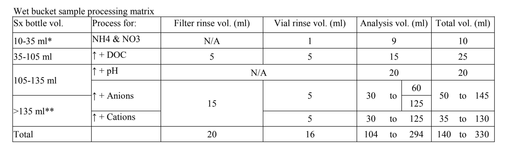

# **ADP Sample Processing Protocol**

Upon returning from the field, remove buckets from plastic bags and wipe any soil/debris off the top, bottom and sides of each bucket.  
When necessary, buckets can be left in the cold room for up to a week before weighing.

## **Dry collection:**

Wearing nitrile gloves, open each dry bucket and remove any contamination (insects, bird droppings, etc.) with HCl-washed and nanopure-rinsed forceps. Ensure contaminants are noted on the field datasheet.  

Using a nanopure-rinsed 500mL graduated cylinder, add 500mL of nanopure water to the bucket.  

With the lid off, swirl the water around the inside of the bucket as high as possible without any risk of spillage. Rest the lid loosely on top of the bucket (do not push lid down).  

Place each bucket on the reciprocal shaker in GWC681 for 10 minutes.  

Rinse a 500mL plastic HCl bottle with a small amount of sample (~5-10mL), and then pour the remaining sample from the bucket into the bottle. Record the HCl bottle number on the datasheet.  

Replace the lid on the bucket and set aside to be cleaned.

### **For ammonium (NH4+) and nitrate (NO3-) analysis:**

Label an ammonium centrifuge tube with "ADP", "site-D" (for dry collection; "site-W" for wet), and date.  

Rinse the tube with a small amount of sample and then fill and cap.  

Centrifuge at 8000 rpm for 10 minutes (make sure rotor is balanced).  

Place the tubes in a tube rack labeled with the date and "ADP-N", then store the tubes in the freezer in GWC630 for analysis on the Lachat flow-injection analyzer.  

### **For Dissolved Organic Carbon (DOC) analysis:**

Using a clean, nanopure-rinsed 25mm filter apparatus with an ashed GF/F 25mm filter, filter a small amount of sample (~5mL) to rinse and then discard.  

Filter ~30mL of sample.  

Record the DOC vial number on the datasheet.  

Rinse the vial with ~3mL of the filtered sample. Discard the rinse and then fill the DOC vial with the remaining filtrate.  

Rinse the filter apparatus with nanopure before beginning the next sample.  

Acidify each sample with 2 drops of concentrated HCl.  

Place the samples in a tube rack labeled with the date and "ADP DOC-Acidified" on a strip of tape, then store the tubes in the cold room in GWC675 until the samples can be run (preferably within 24 hours).

### **For anion and cation analysis:**

Label two sterile 50mL Falcon tubes with "ADP", "site-D" (for dry collection, "site-W" for wet), and "anions" or "cations" (one of each).  

Using a clean, nanopure-rinsed 47mm filter apparatus with a Supor-450 47mm membrane filter, filter a small amount of sample (~15mL) to rinse and then discard.  

Filter enough of the remaining sample to rinse and fill the two 50mL Falcon tubes.  

Fill the anion tube with filtrate, then cap. The Falcon tubes are sterile so do not need to be rinsed with sample prior to filling.  

Repeat with cation tube.  

Rinse the filter apparatus with nanopure before beginning the next sample.  

Place the anion samples in a Styrofoam tube holder labeled with the date and "ADP Anions" on a strip of tape, then store the tubes in the cold room in GWC675 until samples can be run (preferably within 24-48 hours of collection for reactive species).  

Place the cation samples in a Styrofoam tube holder labeled with the date and "ADP Cations- Acidified" on a strip of tape and then acidify the cation samples as follows:

* Place an empty 50mL Falcon tube on the balance and tare.
* Weigh the cation Falcon tube on the tared balance and record the sample weight (in grams) on the datasheet.
* Multiply the weight by 7.144. The result equals the amount (in microliters) of ultrapure HNO3 to add. Record this volume on the datasheet.
* Under the hood, use the adjustable pipette designated for acids to add the acid to the samples.
* Once acidified, the samples are stored on the shelf in the storage room in GWC681.

## **Wet collection:**

Notes:  
If there is less than ~10mL of sample in the wet bucket, note this on the datasheet and do not process the sample. If the sample bottle volume is limited (i.e. 10 < 140mL) or lost, note the unprocessed subsamples on the datasheet.  

In cases when there is not enough rain to complete all of the analyses, the sampling priority is as follows: Ammonium/nitrate, DOC, Anions, Cations, pH. See the following table for volume requirements for each analysis:

** Figure 1: Wet bucket sample processing matrix.**

Remove the wet collection bucket from the plastic bag and wipe any soil/debris off the top, bottom and sides of each bucket.  

Tare the 12kg balance in GWC681 and weigh each bucket.  

Record the total weight (in kilograms) on the datasheet. Subtract the lid and bucket weights from the total weight and record the net sample weight (in grams) on the datasheet.  

Perform steps 5-9 of the above dry collection protocol.  

After step 9 of the dry collection protocol, measure the pH of the sample remaining in the 500mL HCl bottle using the pH meter in GWC677 and record on the datasheet.

## **Lab cleanup:**

Rinse, dry, and HCl-wash any glassware used.  

Clean buckets and lids according to the "Bucket Cleaning, Bagging & Prep" protocol.  

Ensure an adequate supply of ashed 25mm GF/F filters (4 hours in muffle furnace at 500 degrees).  

Filters can be removed from the furnace the following day.  

Note: Bulk Samples - if dry buckets have collected rainwater due to a collector malfunction, process this water as a bulk sample (see ADP Sample Collection Protocol). Add the water from the wet bucket to the dry bucket, then weigh and process as a wet bucket EXCEPT swirl the sample as you would a dry bucket before proceeding.

