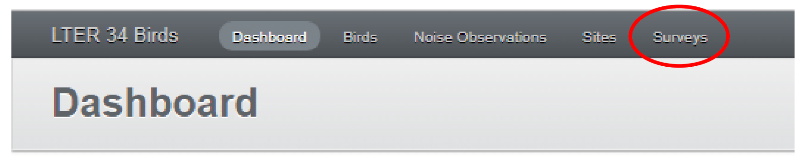
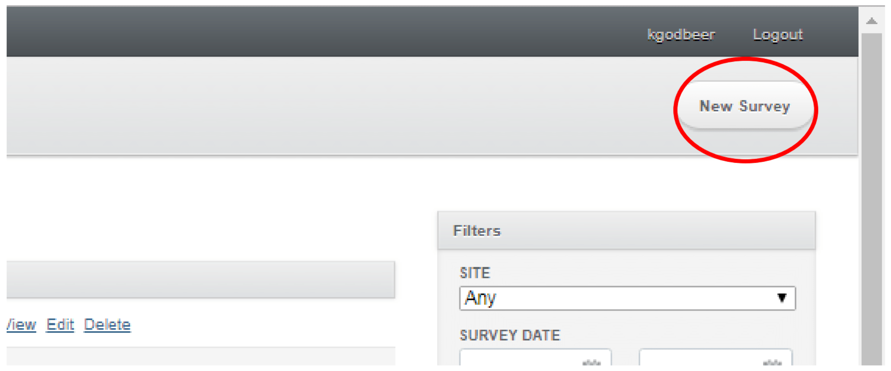
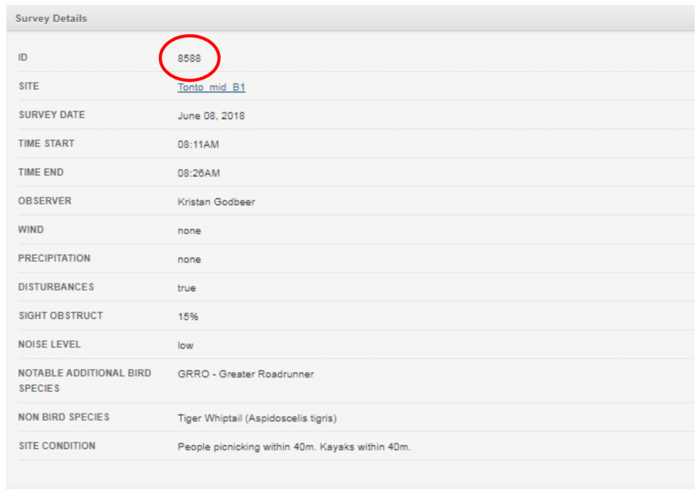

# **Core Birding Data Entry Protocol**

Revised July 2019

* Read the bird survey protocol to understand how the data were collected and how the datasheet was filled out.

* Click on "Surveys" for a list of surveys that have been entered previously.

**Figure 1.  Click on "Surveys".**

* Then click on "New Survey" to begin entering a new survey.

**Figure 2.  Click on "New Survey".**

* Select a "Site", then enter a "Survey date", "Time start", etc., matching database fields to entries at the top of the datasheet. For "notable additional bird species", enter the four-letter code for each species. Unlike for bird species, the "Non-bird species" field (Non-bird/exotic bird species on data sheet) is a text field, so does not require a code. When all fields are entered, click "Create Survey".

* You will notice that an ID number has been created for this entry. Write this number on the top left corner of the paper datasheet. Now the paper datasheet and the corresponding database entry, have a shared unique identification number associated with them. Draw a line under this number and write your initials beneath the line.

**Figure 3.  The ID number created for your entry.**

* Please be sure that you do not use carriage returns when entering free-text fields like "Non-bird species" or "Notes" into the database.

* For each line on the datasheet recording a bird observation, enter the four letter code for Species under "Bird taxon", choose correct distance bin or FT, choose S (seen) or H (heard) or both, choose direction, and enter any notes. Click "Create Bird" when complete. Repeat for every line on the datasheet, being sure to check the reverse side of the datasheet for entries.

* When bird entries are complete, click "Add a new noise observation" to enter data from the Sound Meter that is at the top of the datasheet. Enter the Sound Meter ID for "Meter", "Min noise", "Max noise", and "Noise description", which is the "Prominent noise source" line on the datasheet. If the minimum sound level is Lo, then leave the "Min noise" field blank and choose "below detection" on "Min noise flag". Do not enter "Max noise flag" as this field is no longer collected.

* Once the datasheet has been completely entered, QC your work by clicking on "Surveys", then click on the unique number ID the database has given the survey. All fields from the datasheet will be visible o QC. Use the various edit and delete buttons for each field as needed.