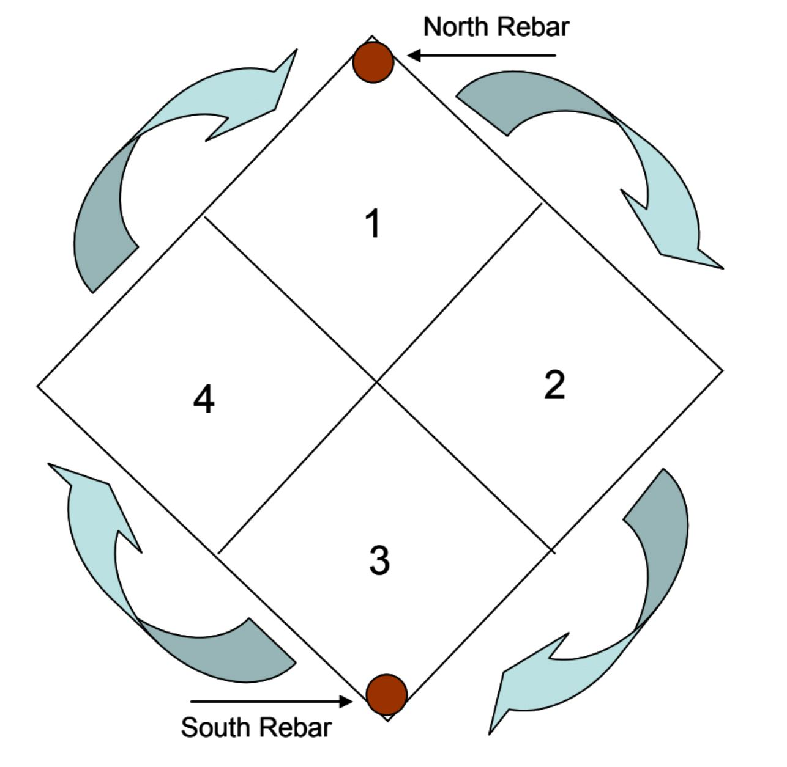

# **DesFert (CN DEP) Spring Annuals Biomass Harvest**

February 2015  
Last editors: Sharon J. Hall, Elizabeth Cook, Scott Collins, Christopher Clark, and Lindsey Pollard  
Updated by Sally Wittlinger, Spring 2016  

Each spring when there is sufficient rainfall, we estimate aboveground net primary productivity (ANPP) of herbaceous annual plants in each of the CN Dep study plots by harvesting the aboveground portion of annual herbs from a 1/2 m x 1/2 m section of established 1m x 1m sub-plots. These plots are distinguished from similar 1m x 1m sub-plots that are used for community composition. Take care to avoid the community composition sub-plots! Only harvest the sub-plots that are designated for biomass.

## **Protocol overview:** 

In each CN Dep plot, we established 4 "biomass" sub-plots per plot, two in each of two patch types, between shrubs (IP for 'inter-plant space') and under the canopies of *Larrea tridentata* (P for 'under plant'). Each sub-plot is coded with the patch type (IP or P); the letter B for biomass (to distinguish it from the community composition sub-plots which are not harvested and do not have a letter B after the patch type code); and the sub-plot number (1 or 2). For example, IPB1 & IPB2 are interplant space sub-plots one and two, and PB1 and PB2 are sub-plots 1 and 2 under *Larrea* shrubs. Remember that the biomass sub-plots are distinguished from the community composition sub-plots with the letter B after the patch type code (example, IPB1 = Biomass sub-plot 1, inter-plant space). Within each 1m x 1m biomass sub-plot, teams will clip aboveground annual biomass from **one** 1/2 m x 1/2 m quadrat in each 1m biomass sub-plot. This sub-section is rotated each year so that any given patch of ground is harvested at the most once every four years. Teams will carefully write the plot identifier on paper bags. (Double-check the labels! Labeling mistakes are the most common error in this procedure). Then, teams will cut all grean and brown herbaceous plant biomass that occurs within the boundaries of the 1/2 m x 1/2 m sub-section and place it in the pre-labeled bag. After the harvest is done, teams will dry the bags and biomass at 60 degrees Celsius for 48 hours, then weigh the biomass (subtracting the weight of the bag) on a scale and record.

## **Supplies:**

* List of sub-sections (1/2 m x 1/2 m sub-quads in each 1m x 1m plot to sample this year; 1 list for each person)
* 1m x 1m & 1/2 m x 1/2 m PVC piping (one for each person)
* 90 degree PVC elbows
* Paper lunch bags for biomass
* Paper grocery bags for either biomass within a plot (if it's a good rainfall year), or to collect/organize labeled lunch bags from each site
* Coin envelopes to collect *Pectocarya recurvata* for nutrient analysis (collect from outside of the sub-plot but within the main nutrient plot)
* Sharpies
* Scissors/shears
* Knee pads/garden kneeling mats
* Gardening gloves
* Site directions (in binder) and GPS unit
* Key for DBG gate padlock, keycode for EME and MCS gate padlocks
* Labeling tags, rebar, mallet (to replace rebar or tags for sub-plots at any site)

**Figure 1.  Layout & sampling rotation of biomass quadrats.**

## **Protocols:**

### **Field Protocol:**

1. Before you go out to the field:
   1. The 1/2 m quadrats in each subplot are numbered (but **not** marked on the ground) as 1 to 4 - quadrat 1 is north, 2 is east, 3 is south, and 4 is west (see Figure 1). The quadrats are sampled on a rotating basis, such that each quadrat is sampled only once every 4 years (e.g. if quad 1 was sampled last year, quad 2 is sampled this year). Before you go to the field, create a new list showing which quads to sample for each plot, using last year's list as a reference: (R:\CAP_LTER\research_data\CAPLTER_TechnicianFolder\CNdep\Biomass_Annuals\Biomass Collection).
   2. Pre-label all bags in the lab prior to field work so no plots are missed or mis-labeled. This can also be done in the field if necessary. On each lunch bag, record the date; your name/initials; site (3 letter code); plot number (1 to 75); treatment (C1 - no sampling from C2 plots, Nitrogen [N], Phosphorus [P], and Nitrogen+Phosphorus [NP]); Patch type (PB or IPB) and sub-plot within patch type (1 or 2). See Tables 1 and 2 below for plot numbers and site codes.
      1. Example: Date: 3/17/15; Sampling crew: SJH and KB; LDP; Plot 1 (N); IPB1 *(Note to double check the plot numbers and sub-plot numbers!)*
2. At the site: Locate the biomass sub-plots within each larger 20m x 20m plot. In each CNDep plot, the biomass sub-plots are marked with 2 pieces of rebar which serve as plot corners - 1 long piece oriented to the north and a shorter piece oriented to the south.
3. Construct a 1m square using the PVC pipes and elbows. Place it around the sub-plot, using the north (taller rebar) and south rebar (shorter of two rebars) as corners.
4. If the rebar is missing - use the GPS unit to locate the sub-plots and replace rebar and tags as necessary. If it is difficult to tell which rebar is higher (indicating quadrat #1), assume the corner of the plot closest to North direction is quadrat #1.
5. Locate the correct quadrat to sample using the list, and section it off using two 1/2 m pipes and an elbow. Adjust the PVC pipes around the shrubs if needed in the PB plots.
6. Remove any leftover, dead biomass from prior years within the quadrat (esp. lock for dead *Amsinckia* stalks). If this year's biomass has already senesced, take care to collect it rather than discard it. In other words, your goal is to collect all biomass that has grown during this year, not previous years.
7. Clip all the aboveground biomass within the boundaries as close to the soil as possible. *Take care not to disturb the soil surface, including gravel cover.* Use multiple lunch bags if all the material won't fit in 1 bag; be sure to label multiple bags (e.g. call it "bag 1 of 2" or "bag 2 of 2"). Some biomass will remain on the surface after clipping; this is ok as long as all biomass is removed to the same height by each person during all the sampling from all the plots and sites! *Calibrate this technique with your teammates on your first plot.*
8. Collect full *P. recurvata* plants, clipped from the ground, for nutrient analysis. Put them in coin envelopes in the field.
   * Take five individuals (or enough to fill a coin envelope) of *P. recurvata* from P and IP locations, but just outside the biomass plots (but still in the 20m x 20m plot, of course). If there are not enough plants just outside the biomass plots, plants can be taken from anywhere in the 20m x 20m treatment plots.
   * Do not take *P. recurvata* from inside the biomass plots.

1. **This step is important:** Count the bags and **check the labels** before leaving each site. Then place the smaller bags into labeled grocery bags until ready to process in the lab.

### **Lab Protocol (biomass):**

1. After you have returned from the field, double check that you have all the paper bags for each site and that they are correctly labeled.
2. Dry all the bags with biomass in a lab oven at 60 degrees Celsius. Biomass should continue drying until weight measurements no longer fluctuate, about seven days. Samples may be stored at 60 degrees Celcius for a longer period of time if necessary.
3. In addition, dry 10 empty paper lunch bags at 60 degrees Celsius for the same length of time as the biomass samples.
4. Pre-label a data sheet with the site and plot labels *in order*. The data sheet should have five things at the top:
   1. Date
   2. Personnel name
   3. Mass of 10 dried lunch bags (see below)
   4. Title of datasheet, which should be "Biomass data from 1/2 m x 1/2 m subplots"
   5. Page numbers, which should read: Page x (number of this data sheet) of x (total number of data sheets in the activity)
5. The data sheet should have four columns:
   1. Site
   2. Plot number
   3. Sub-plot patch type
   4. Sub-plot number
   5. Biomass + Bag (g).  Label the column like this to avoid any confusion.
6. When preparing to weigh the biomass, only remove 10-15 sample bags at a time so that the dried biomass does not gain water while waiting to be weighed.
7. Tare the scale to zero. Then, leaving the dried aboveground biomass inside the bag, *weigh and record weight of the bag + dry aboveground biomass sample in grams.*
8. Record the weight of the biomass + bag on the data sheet. Take care to double check that you are correctly recording the weight with the correct label on the sheet. **This step is where most errors occur. Please pay attention at this step - do not be distracted or you are likely to make a mistake!**
9. Finally, record the weight of 10 empty lunch bags. Later, when you are entering data into the computer, you will subtract the average weight of 10 lunch bags from each sample (this method prevents us from dumping out the dry biomass, which spills and is hampered by static during the weighing process.)
10. Once weighing has been completed, biomass should be transferred to the field leader and stored in the CAP LTER data sheet archive.

### **Lab Protocol _(P. recurvata)_**

1. After collection, *P. recurvata* plants should be rinsed with DI water, put back in the coin envelopes, and dried at 60 degrees Celsius.
2. Dried *P. recurvata* biomass should be ground with a ball mill and stored in scintillation vials until total C, N, and P analyses.
3. If funds are available, total C and N should be determined using the CHN analyzer at Goldwater. Samples for total P and metals should first be digested using the MARS microwave in Goldwater, then analyzed by ICP-MS in the Keck lab.

### **Calculations:**

To calculate the dry mass, subtract the average bag weight from ~10 new/unused brown paper bags.

To calculate the dry biomass per m2, multiply the dry mass by 4 (because biomass only collected from 1/4 of plot).

### **Table 1. Site names and codes.**

**Site** | **Code** | **Location**
--- | --- | ---
Lost Dutchman State Park | LDP | East Valley
McDowell Mtn Regional Park, North | MCN | East Valley
McDowell Mtn Regional Park, South | MCS | East Valley
Usery Mtn Regional Park | UMP | East Valley
Salt River Rec Area | SRR | East Valley
Piestawa Peak | PWP | Urban Core
Desert Botanical Garden | DBG | Urban Core
Mountain View Park, North Mtn Park | MVP | Urban Core
South Mountain Park, East | SME | Urban Core
South Mountain Park, West | SMW | Urban Core
White Tanks Mtn Regional Park, East | WTM | West Valley
Estrella Mtn Regional Park, East | EME | West Valley
Estrella Mtn Regional Park, West | EMW | West Valley
Sonoran Desert National Monument, East | SNE | West Valley
Sonoran Desert National Monument, West | SNW | West Valley

### **Table 2. Plot numbers and treatment assignments.**

Random Treatment Assignments for Plots in the CNDep project

**Loc** | **Site Code** | **Plot #** | **Tmt** | **Loc** | **Site Code** | **Plot #** | **Tmt** | **Loc** | **Site Code** | **Plot #** | **Tmt**
--- | --- | --- | --- | --- | --- | --- | --- | --- | --- | --- | ---
East | LDP | 1 | N | Core | SME | 26 | N | West | SNE | 51 | C1
East | LDP | 2 | C2 | Core | SME | 27 | NP | West | SNE | 52 | N
East | LDP | 3 | NP | Core | SME | 28 | P | West | SNE | 53 | C2
East | LDP | 4 | P | Core | SME | 29 | C1 | West | SNE | 54 | NP
East | LDP | 5 | C1 | Core | SME | 30 | C2 | West | SNE | 55 | P
East | UMP | 6 | NP | Core | PWP | 31 | N | West | SNW | 56 | N
East | UMP | 7 | C2 | Core | PWP | 32 | C2 | West | SNW | 57 | P
East | UMP | 8 | P | Core | PWP | 33 | C1 | West | SNW | 58 | C2
East | UMP | 9 | C1 | Core | PWP | 34 | NP | West | SNW | 59 | NP
East | UMP | 10 | N | Core | PWP | 35 | P | West | SNW | 60 | C1
East | SRR | 11 | C2 | Core | MVP | 36 | N | West | EMW | 61 | C2
East | SRR | 12 | NP | Core | MVP | 37 | NP | West | EMW | 62 | NP
East | SRR | 13 | C1 | Core | MVP | 38 | C1 | West | EMW | 63 | P
East | SRR | 14 | P | Core | MVP | 39 | P | West | EMW | 64 | C1
East | SRR | 15 | N | Core | MVP | 40 | C2 | West | EMW | 65 | N
East | MCN | 16 | N | Core | SMW | 41 | C2 | West | EME | 66 | C1
East | MCN | 17 | P | Core | SMW | 42 | N | West | EME | 67 | N
East | MCN | 18 | C1 | Core | SMW | 43 | P | West | EME | 68 | NP
East | MCN | 19 | C2 | Core | SMW | 44 | C1 | West | EME | 69 | C2
East | MCN | 20 | NP | Core | SMW | 45 | NP | West | EME | 70 | P
East | MCS | 21 | NP | Core | DBG | 46 | P | West | WTM | 71 | C1
East | MCS | 22 | N | Core | DBG | 47 | C2 | West | WTM | 72 | C2
East | MCS | 23 | P | Core | DBG | 48 | NP | West | WTM | 73 | NP
East | MCS | 24 | C1 | Core | DBG | 49 | N | West | WTM | 74 | P
East | MCS | 25 | C2 | Core | DBG | 50 | C1 | West | WTM | 75 | N