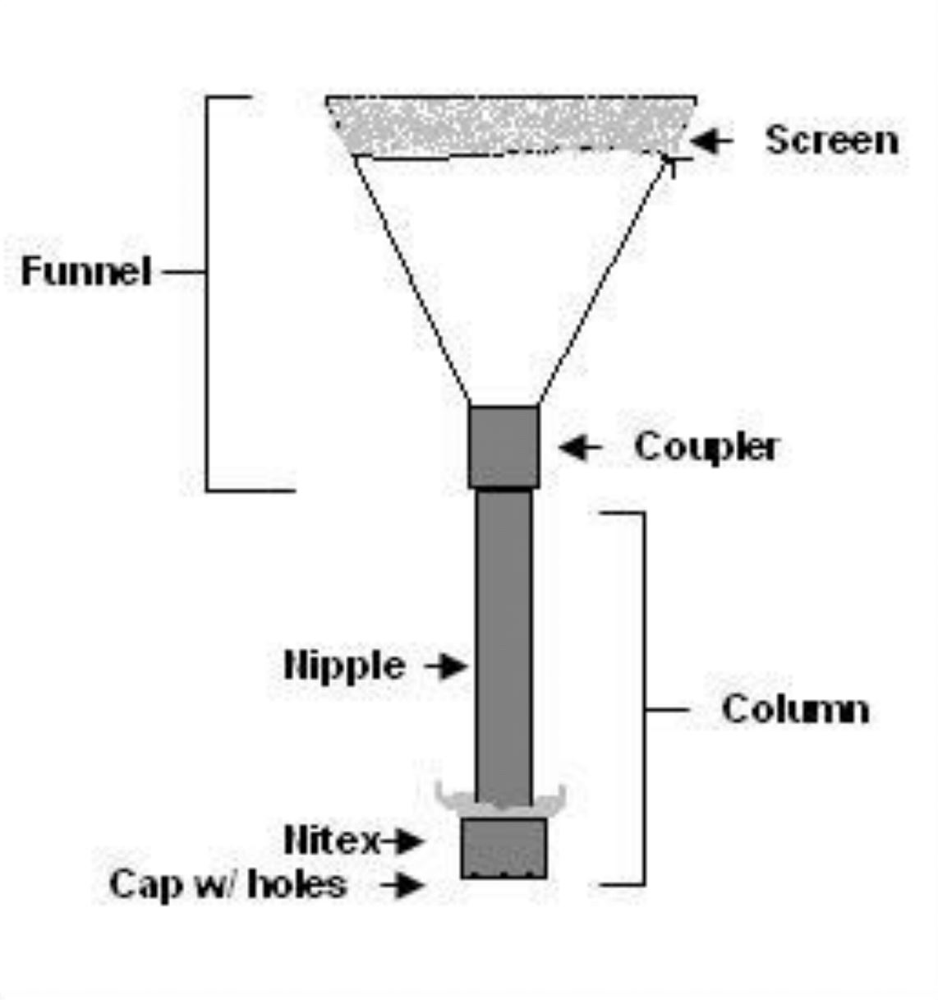
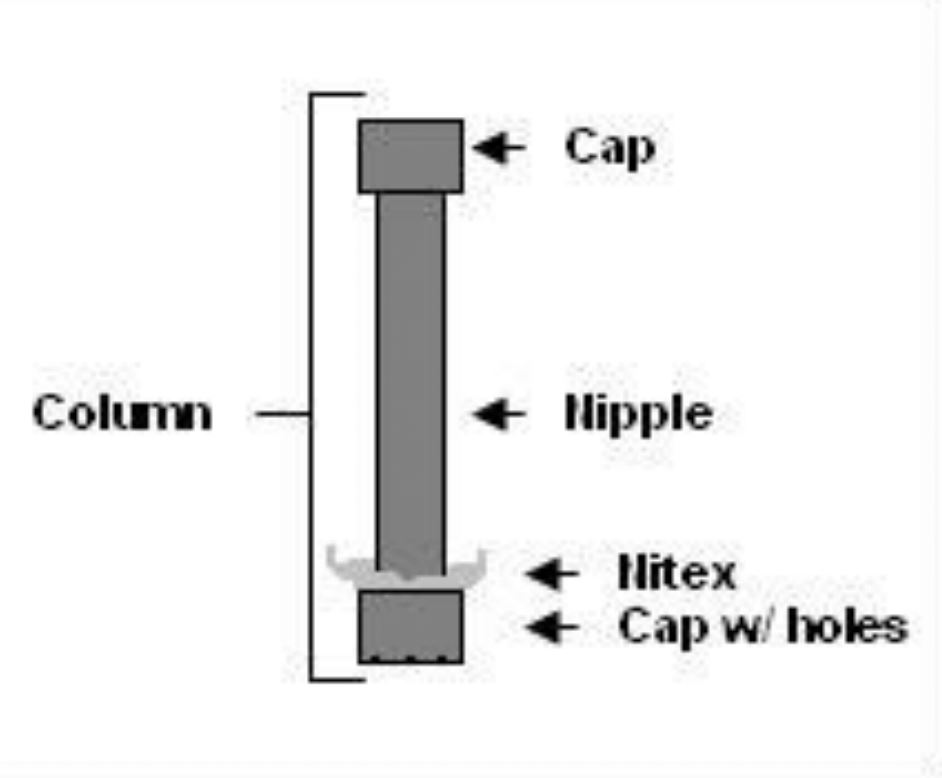
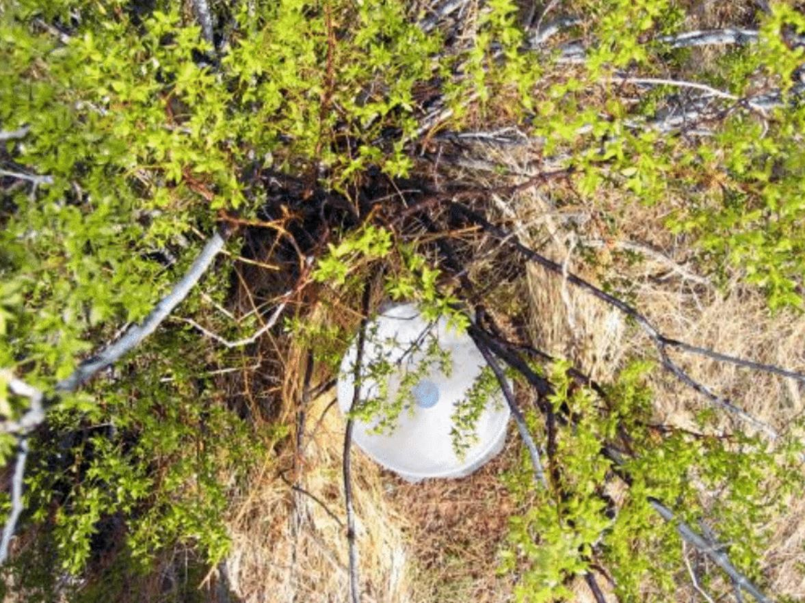
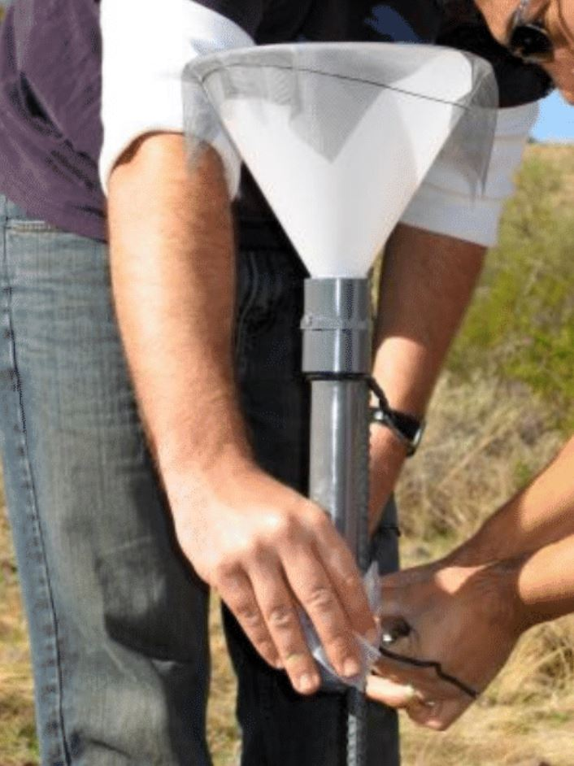

# **DesFert (CN Dep) Deposition Collector Protocol (7/2009)**

Do rates of nitrogen deposition vary across Phoenix? How much nitrogen is added to soils from throughfall (underneath shrubs) compared to from deposition alone (in plant interspaces)? To answer these questions, we will measure nitrate and ammonium concentrations that will be collected on a column of anion and cation exchange resins that are placed within plant interspaces and beneath individuals of *Larrea* in each of our sites. In order to measure deposition rates, we will capture atmospheric ammonium and nitrate arriving to the deposition collectors over a pre-determined period of time.

**Figure 1.**

Collectors are replaced every 3 months1. A set of collectors are located at each CN Dep study site with the exception of Mountain View Park (MVP). Each site has 4 collectors - 2 located underneath *Larrea* shrubs and 2 tied to rebar in interplant spaces. The deposition collectors consist of 2 main parts that are constructed in the lab - a screen-covered funnel and a resin column (fig. 1). In the field, the funnel is screwed onto the column and bird spikes are attached to the interplant collectors prior to installation.

1 except for 2 extra interplant collectors per region (WTM, DBG, MCS), which are replaced every 6 months.

**Figure 2.**

In addition to the 4 main collectors, 6 control columns are placed at 1 designated site in each region (WTM, DBG, and LDP). Three of the control columns are located underneath *Larrea* and 3 are tied to rebar in interplant spalces. A cap replaces the funnel in the control columns to prevent atmospheric ions from contacting the resin (fig. 2).

## **Prep:**
### Deposition Collector Construction:
Supplies: be sure to take stock of supply levels early; many items on this list must be ordered online and shipped to campus.
* Plastic funnels - 1 for each non-control column
* Threaded PVC couplers - 1 for each non-control column
* Structural plastic adhesive cartridge with applicator gun, plunger, and mixer nozzle
* PVC caps for bottom of columns (holes) - 1 for each column
* PVC caps for top of control columns (w/o holes) - 1 for each control column
* Nitex plankton netting squares - 1 for each column
* Fiberglass screen squares - 1 for each funnel
* Aquarium filter pad squares - 1 for each funnel
* PVC nipples - 1 for each column
* Glass wool
* Bird spikes - 1 for each interplant collector
* Resin
* Parafilm
* 20-gauge steel wire
* 45-gallon trash bags

1. Begin by attaching the funnels to the couplers.
   1. First cut the stem off each funnel with a PVC saw so that the small opening of the funnel is 1 cm less than the inside diameter of the couplers.
   2. Trim off the ridges that run on the outside of funnel with a razor blade so it will sit flush with the mouth of the coupler.
2. Once all the funnels have been cut, attach the mixing nozzle to the adhesive cartridge and place in adhesive gun.
   1. With the funnel upside down on the table, place a thin line of adheisve just inside the lip of the coupler.
   2. Quickly turn the coupler over and place it over the small opening of the funnel.
   3. Adjust the coupler so it is level in regard to the funnel and hold for 1 minute or until it will stay level without you holding it. Allow to dry at least 24 hours.
3. In order for rain or rinse water to drain from the column, holes have to be drilled in the cap that attaches to the bottom of the column (do not drill holes in the 18 caps needed for the top of the control columns).
   1. Use a 3/16" drill bit to make 5 evenly spaced holes in each cap. Remove any shavings.
4. Cut the Nitex into 8 cm square sections.
5. Cut the fiberglass screen into 1' square sections (same as 1 floor tile).
6. Cut aquarium filter pad into 4 cm sections.
7. Everything that will touch the resin or rinse water needs to be acid-washed in an HCl bath. This includes the coupler and funnel after the adhesive has dried, caps, nipples, Nitex squares, fiberglass screen squares, aquarium filter pad squares, glass wool, and bird spikes. The Nitex, fiberglass screen, aquarium floss and glass wool should only stay in the acid bath for 15 minutes. For metal bird spikes quickly dip in HCl-wash and rinse with copious DI.
8. After everything has been acid-washed, rinsed, and air dried, the columns are ready to assemble. It helps to have a ring stand that you can clamp each column onto while you fill them. You will also need to place lab paper on the table to catch any resin that spills. As with anything else in the lab, use sterile technique while assembling the collectors.
   1. With a Sharpie, sequentially number each nipple. Make sure there are no duplicate numbers.
   2. Place a thin piece of glass wool inside a cap. Make sure it covers the holes. The glass wool serves as a backup for the Nitex, preventing the resin from falling out the holes. However, if you use too much glass wool, it will impede flow and columns will take longer to rinse in the field.
   3. Hold a piece of Nitex over one end of the nipple and push the middle of the Nitex into the column 2-3 cm. This provides slack for the Nitex, which can shrink and tear otherwise.
    4. While holding the Nitex in place, thread cap onto the same end of the nipple. **IMPORTANT**, do not over-tighten the cap! It will tear the Nitex. Simply shrink and tear otherwise.
9. Turn the column over and clamp it to the ring stand so it is free standing.
   1. Place a small clean funnel in the top of the column.
   2. Using a clean 100 mL beaker, volumetrically transfer 60 mL of resin to the column. This does not need to be exact as long as it's close.
   3. Remove the small funnel and cover with Parafilm. We will attach the coupler/funnel assembly to the column in the field.
   4. Place all the columns needed for each region in a sweater box.
10. Finish constructing the funnels.
   1. Place the aquarium filter square in the small opening of each funnel to prevent dust and debris from falling into the column.
   2. Place the funnel upside down on a square of fiberglass screen. Thread wire through the screen and tighten it around the funnel so that the screen completely covers the top of the funnel.
   3. Place all the funnels needed for each region in a large trash bag. The plastic is very fragile so take care in handling the trash bag.
11. Place all the bird spikes needed for each region in a sweater box.
12. All that is left is to attach the columns to the funnels and then attach the bird spikes, which are both done in the field.

### Gather Field Supplies:
Installing the collectors is usually spread out over 3 fiel days _ 1 day for each region.
* Columns - 1 for each collector + 6 capped control columns
* Screen-covered funnels - 1 for each collector
* Bird spikes - 1 for each interplant collector
* Carboy filled with DI
* Watering can (wrapped in trash bag to keep clean)
* 500 mL Nalgene bottles (4)
* 1 L plastic graduated cylinder
* Foil - 1 square for each non-control column
* Extra aquarium filter pad squares
* Extra 45-gallon trash bags
* Baling wire (for attaching interplant connectors to rebar)
* 20-gauge steel wire (for attaching bird spikes)
* Wire cutters
* Slip joint pliers
* Field data sheet, clipboard
* Pencils, Sharpies
* CN Dep foler w/ site maps & study permits
* Keys for MCS & DBG
* Nitex gloves & work gloves
* Backpack

## **Field Protocol:**
### Establishing a new study site or repairing damage/vandalism:
Supplies:
* 3 soil augers (3-in diameters? We want only slightly larger than the dep collectors)
* PVC hole liners (same diameter as auger and only a bit bigger than the dep collectors)
* Pea gravel for the bottom of the auger holes
* 1.5 m rebar to mount interplant collectors
* Sledge hammer

1. Randomly pick 2 individuals of *Larrea* and two interplant positions per site. Choose individuals outside of the fertilization (or control) plots and away from obvious human foot traffic, roadways, buildings, or animal activity.
2. Augur a 40 to 50 cm hole beneath the shrub.
3. Place PVC liner in hole.
4. Pour 3 cm of pea gravel into hole to assist with drainage.
5. Move or break dead branches if necessary to give the funnel some room - the funnel should be aboveground but not touching the bottom branches of the shrub nor the bottom of the hole.
6. To install interplant collectors, pound in 1.5 m rebar with a sledge hammer at the selected site.

### Changing out the dep collectors:
1. Before leaving the field vehicle:
   1. Fill the 500 mL Nalgene bottles with DI from the carboy.
   2. Using the 20-gauge wire, attach the bird spikes to the screen-covered funnel.
   3. Remove the Parafilm from the columns and attach the funnels.
   4. Bring the following with you to the study plot: 4 collectors, 6 control columns (if necessary), filled Nalgene bottles, watering can, graduated cylinder, foil, baling wire, wire cutters, pliers, field data sheet & clipboard.
2. Examine all collector funnels and remove any large material that has settled on them (e.g. leaves, twigs, animal excrement, etc.). Make a note of any large amount of materials removed or any unusual appearance of collectors/funnels.
3. For beneath-shrub collectors: Pour the water from 1 Nalgene bottle into the graduated cylinder and measure out 500 mL of DI water. Pour into the watering can and sprinkle water over branch so that the majority (all if possible) of the water enters (and rinses) the funnel.
4. After letting the water drain from the column, carefully move branches out of the way to access the deposition collector and carefully remove the used collector.
5. Place a new deposition collector in the hole, making sure to prevent particles from entering the funnel during the exchange.
6. For interplant collectors, pour 500 mL of water over the funnel to rinse deposited particles into the resin column.
7. After letting the water drain from the column, carefully detach collector from the rebar with the wire cutters. Replace with a new collector, using the baling wire and pliers to tighten.
8. If the water won't drain through the collector, you may have to remove the screen from the funnel with wire cutters and gently poke the aquarium filter with a piece of wire until it starts draining.
9. For the control columns, simply remove the old columns from the ground or rebar (no water) and replace with new columns and wire. For the beneath-shrub controls, make sure that the top of the cap is flush with the PVC hole liner and that you've attached some baling wire as a 'handle' so the column doesn't get stuck in the hole.
10. Record the number of the old column on the datasheet. There should be no duplicate numbers. On the datasheet, beneath-shrub collectors are labeled 'LATR1 & LATR2'; interplant collectors are labeled 'IP1 & IP2'. It does not matter which collector is called '1' and which is '2'.
11. Unscrew the funnel and cover the resin column with a piece of foil. Remove the bird spikes from the screens before putting them in a trash bag.
12. Store collected resin columns upright in the sweater box in the vehicle, making sure they don't tip over. Record on the datasheet in any resin is lost.
13. Place the columns in the walk-in refrigerator in GWC 673 until ready to perform extractions.

**Figure 3.**
**_Larrea tridentata_ Dep Collector (LATR)**

**Figure 4.**
**Interplant Dep Collector (IP)**

## **Resin Extraction Protocol:**
Mixed bed resins are charged with H+ and either Cl- or HCO3-. The resins have a low affinity for these ions, which are replaced by NH4+, NO3-. The extractant used to remove N ions from the columns can vary depending on resin type and the type of analysis required. Extraction for the mixed bed resin is described in the following procedure using 2M KCl. We are currently working on a 0.5 or 1M HCl extraction method so that we can analyze for trace metals on ICP-OES as well as NH4 and NO3.  

**Supplies:**
* Solutions of 2M KCl in 20 L carboy (149g KCl/L DI, put on shaker until dissolved)
* 1 gallon glass jug and bottle top dispenser
* Capped 250 mL plastic bottles, labeled with sequential numbers - 1 per sample
* Wash bottle
* 250 mL Erlenmeyer flasks, labeled with sequential number - 1 per sample
* Plastic cone funnels - 1 per sample
* Whatman #42 ashless filter paper - 1 per sample
* Buchner funnel, side arm Erlenmeyer flask, vacuum line
* 250 mL graduated cylinder
* 50 mL falcon tubes - 1 per samples; labeled with 'CN Dep', date, site, and either LATR1 or 2, or IP1 or 2. Using the datasheet as a reference, write the column number of each sample on the cap of the falcon tube.  

**Procedure:**
1. Remove resin columns from walk-in refrigerator.
2. Fill the gallon jug with KCl solution and set the bottle top dispenser to 50 mL. Use this to dispense the KCl solution into the wash bottles.
3. Match the number on the column with the number on a plastic 250 mL bottle. Remove tin foil covering the open end of the column and place the column upside down over the 250 mL bottle (column fits just inside bottle opening). Place 200 mL (4 pumps) KCl solution into an acid-washed wash bottle (it is important to use exactly 200 mL of KCl). Insert the wash bottle tip in to the cap holes and wash the majority of the resin into the bottle (tapping the bottle on the counter top helps facilitate this).
4. Once the majority of resin has been removed from the column, unscrew the cap and carefully rinse out any remaining resin into the bottle. Discard the glass wool and Nitex. Note on the datasheet if there is soil in the column/cap for any reason, or if the Nitex has ripped and resin lost.
5. Pour the remaining KCl (if any) into the plastic bottle from the wash bottle. It is important to quantitatively transfer the resin + 200 mL KCl into the 250 mL bottle due to dilution issues.
6. Repeat until all resin has been transferred from the columns.
7. Prepare 3 lab blanks - fill 3 labeled 250 mL bottles with 200 mL KCl and process as per samples.
8. Place the 250 mL bottles onto the shaker and shake for 1 hour.
9. While the samples are on the shaker, set up the 250 mL Erlenmeyer flasks in numerical order on the lab bench and place a plastic cone funnel in the month of each.
10. Place ~15 filter papers into a Buchner funnel and attach to a vacuum line.
11. Pour 100 mL 2M KCl through the filters and turn on vacuum. Let sit 1 min and add an additional 100 mL 2M KCl while pump continues to run. Let vacuum run until filters no longer drip. Repeat until you have enough pre-leached filters for each sample.
12. Fold the pre-leached filter paper cones and place into funnels.
13. Once the samples have shaken, set each sample bottle next to its matching flask. Pour 5-10 mL of supernatant from each sample into the filter paper-lined funnels, let drain into Erlenmeyer flasks. Take care to avoid getting resin between the filter and the funnel! Also avoid splashes by pouring onto the side of the funnel wall!
14. Swirl solution in flask and discard into designated waste container. This step is done to clean the flask in case of contamination.
15. Pour the remaining supernatant into corresponding funnels and let filter.
16. While the KCl is filtering, place the labeled falcon tube next to the correct flask number.
17. Once all the KCl has been filtered, remove funnels, discard filter paper into designated waste container, and pour 5-10 mL of filtered KCl into falcon tube to remove any contamination. Swirl solution in falcon tube and discard into designated waste container.
18. Pour ~ 50 mL of filtrate into labeled falcon tubes and discard the rest into the designated waste container.
19. Place the falcon tubes in Styrofoam tube holders and place in freezer in prep room of GWC 677. Frozen extractions will be defrosted and analyzed at a later date on the Lachat using the phenol method.

## **Clean-up:**
1. Empty remaining resin from 250 mL bottles into fine sieve in sink. Place the resin waste in a designated waste container.
2. All solid resin waste and KCl w/ trace resin waste must be properly labeled and picked up by Hazardous Waste.
3. All funnels, nipples, caps, 250 mL plastic bottles, plastic cone funnels, flasks, and bird spikes should be washed first with Liquinox soap and then HCl-washed. For metal bird spikes, quickly dip in HCl-wash and rinse with copious DI.
4. HCl-wash all other glassware, watering can, graduated cylinder, and 500 mL Nalgene bottles.