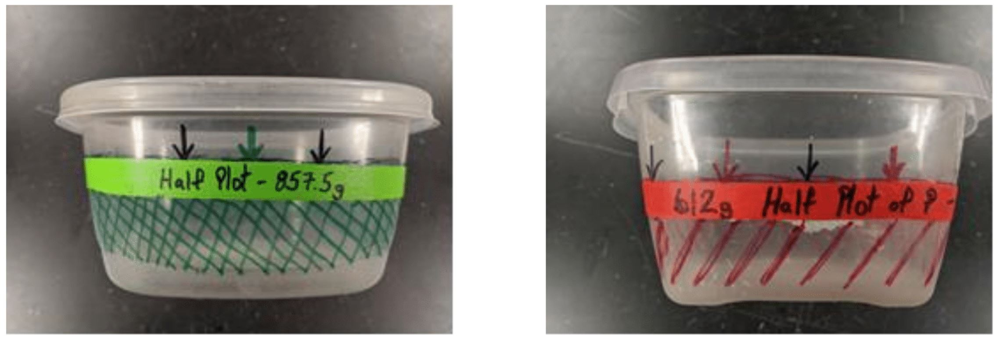

# **DesFert (CN DEP) Fertilization Protocol**

Last updated: September 2019  

## **Overview**

The [DesFert](https://sustainability.asu.edu/caplter/research/long-term-monitoring/desert-fertilization-experiment-formerly-known-carbon-nitrogen-deposition/) project consist of 15 sites positioned in the Phoenix metropolitan core and surrounding Sonoran Desert. The 15 sites are split into three regions: five sites in the West, five sites in the urban Core (central Phoenix locations) and five sites in the East. Each site consists of five 20m x 20m plots. Nutrient treatments of ambient (no fertilizer, i.e. Controls 1 and 2), nitrogen (N), phosphorus (P), and nitrogen plus phosphorus (N+P) have been assigned to the plots to test the hypothesis that urban N deposition pushes the desert system toward P limitation. Twice a year, corresponding to the start of the winter rains and summer monsoons, the N, P, and N+P plots are fertilized. Nitrogen is applied in the form of ammonium nitrate (NH4NO3) and phosphorus as Triple Super Phosphate (Ca(H2PO4)). The application of fertilizer is the fundamental task within the DesFert project.

Fertilization with N, P, and N and P(N+P)P of 20m x 20m plots at all 5 sites in the West, Central, and East regions will be done twice per year to test the hypothesis that urban N deposition pushes the desert system toward P limitation. The level of N addition (as NH4NO3) is chosen to be ~ twice the current maximum deposition rate, i.e., 60 kg ha-1 y-1; P addition level is 1/5 (by mass; 1/11 by atoms) that of N at 12 kg ha-1 y-1. Fertilizer will be applied twice per year, in January (just before the onset of winter rains or just after the first winter rain), and July (hopefully, shortly after the beginning of the monsoon). Amounts given below are for each fertilization event, i.e. half of the annual application rate.

## **Materials and Supplies:**

Plastic bins for storing and transporting fertilizer are kept at the [CAP-LTER storage facility](https://goo.gl/maps/1UD2wHWYyxzGT7qv8 "Storage facility location on Google Maps") located to the North of the ASU Community Services (CSB) building and the Arizona State Climatology office: 200 E Curry Rd, Tempe, AZ 85281

* [3M particulate respirator N95](https://www.grainger.com/product/3M-N95-Disposable-Respirator-4JF99?cm_sp=Product_Details-_-Customers_Also_Purchased-_-AZIDPBR_P-DPO-53-050719&cm_vc=AZIDPBR_P-DPO-53-050719&req=Customers_Also_Purchased "Link to purchase masks") - good
* 3M 52P71 half-face respirator - better
* Containers for measuring fertilizer (kept with plastic bins at storage)
* Latex gloves for weighing and administering fertilizer on plots
* Gallon and quart size ziplock bags for holding and transporting fertilizer to plots
* Ammonium nitrate fertilizer (NH4NO3), pelletized form: 1.715 kg/plot, pre-weighed (see chart below)
* Triple super phosphate fertilizer, pelletized: 1.224 kg/plot, pre-weighed
* Permanent marking tags for plots
* Red and green duct tape for marking corners
* Pin flags for 10m point (on each plot boundary) and for plot centers
* Field bag to carry fertilizer
* Eye protection to minimize chemical burns
* Long sleeve shirt worn only when applying fertilizer
* Wide brim hat

## **Procedure**

### **Weighing fertilizer:**

Make sure to use appropriate protective gear when working with fertilizer, and please make sure to do all of the weighing outside of the laboratory (outside the building near a hose would be best).
  
In order to speed up the process, two containers have been marked to the level representing the total volume occupied by the appropriate mass of fertilizer (Figure 1). Note that the markings on the containers indicates HALF of the volume of fertilizer needed for each plot, so each container must be filled to the indicated line twice to measure the correct amount of fertilizer per plot.

Use this volume of fertilizer (filling container to the line twice), instead of the mass, to split the fertilizer per plot.

**Figure 1.  Containers used for measuring out Nitrogen (green) and Phosphorus (red) fertilizer.**

Empty the fertilizer into ziplock bags. The fertilizer for the N+P plots can be combined but need to be homogenized prior to spreading on plots (Figure 2).

**Figure 2.  Bag of non-homogenized N+P fertilizers (left). Bag of homogenized N+P fertilizers (right).**

### **In the field:**

Verify that all plots are marked at all plot corners to identify the treatment with (a) metal tags and (b) colored duct tape on rebar and/or (c) metal washers with plot information engraved on them and secured by metal stakes.  The closer the plot is to potential human traffic, the more discreet the markers used to identify the plots need to be. Colors will be as follows:  Green = N; Red = P; Green and Red = N+P. Control plots are marked with white tape. Mark the 10m point on each plot line and the center of the plot with a pin flag (Figure 3)

**Figure 3.  The flags aid in plot orientation and budgeting of the fertilizer.**

### **Spreading the fertilizer:**

*Prior to applying the fertilizer at each plot, find the permanent markers, check the colors on the corners, and double-check the map to clearly understand which of the plots receives each treatment (N, P, N+P).*

Make sure all personal protection gear is in place before beginning fertilization (Figure 4).

* Put on particulate respirator (dust mask).
* Put on eye protection.
* Put on hat.
* Put on long sleeve shirt.
* Put on gloves (change between N and P fertilizers). 

**Figure 4.  Example of proper personal protection while broadcasting fertilizer to plot perimeter.  Photo credit: Bradley Niska**

At each plot, visually identify all four corners and the 10m flags on the boundaries to make sure you know the layout of the plot. This will reduce the possibility of applying fertilizer outside of the plot.

Select a plot corner as a starting point and remove the corresponding bag of fertilizer from the field bag. Hand broadcast the fertilizer by while walking the perimeter of the plot, stopping shortly at each corner to locate the next corner prior to applying more fertilizer (Figures 6-9).  This will minimize the chances of spreading fertilizer outside of the plot boundaries and possibly contaminating other plots. Make sure (absolutely certain) that no fertilizer is dropped in the boundaries between plots!

**Note:** This is extremely important at sites where plot boundaries are separated by a few meters, e.g., Lost Dutchman State Park (LDP; Figure 5).

**Figure 5.  Plots at Lost Dutchman Park.**

**Figure 6.  Start at one corner and hand broadcast the fertilizer as you walk to the next corner.**

**Figure 7.  When the second corner is reached visually locate the third corner and continue the process.**

**Figure 8.  Continue around the perimeter paying close attention to the plot boundaries.**

**Figure 9.  When you have reached your starting point the perimeter of the plot should be covered with a layer of fertilizer.**

Once the plot perimeter is fertilized, move to the center of the plot and spread fertilizer towards the corners using a Frisbee-like throw until the plot is completely fertilized (Figure 10). The goal is to fertilize homogeneously and at a constant density across the entire plot. 

**Figure 10.  Move to the center of the plot and spread fertilizer towards the corners using a Frisbee-like throw until the plot is completely fertilized.**

## **Wrap up**
**The following steps will help minimize the excess inhalation of fertilizer while traveling in the truck.**

* Place all used fertilizer bags in to a trash bag and seal immediately so that it doesn't further contaminate you, tools, the truck, etc.  
* Place trash bag in plastic transport bins in the bed of the truck, remembering to seal the container.
* Remove your long sleeve shirt and dust off any remaining fertilizer from your body and clothes before you enter the truck cab.
* Place shirt, and hat in separate plastic bag and place bag in plastic bin.

## **Fertilization Chart**

**Nutrient** |  **N**  |  **P**
--- | ---: | ---:
Form to add | NH4NO3 | triple super phosphate Ca(H2PO4)2
Fertilizer application rate (kg N ha-1 y-1) | 30 | 12
applications per year | 2 | 2
mass nutrient atom per m2 per application (g) | 1.5 | 0.6
mass nutrient atom per 400m2 plot per application (g) | 600 | 240
**mass fertilizer per 400m2 plot per app (kg)** | **1.715** | **1.224**
total mass fertilizer needed per year (kg) | 102.9 | 73.4
total mass fertilizer needed per year (lb) | 226.8 | 161.9

*Figure 11 Fertilization Chart*