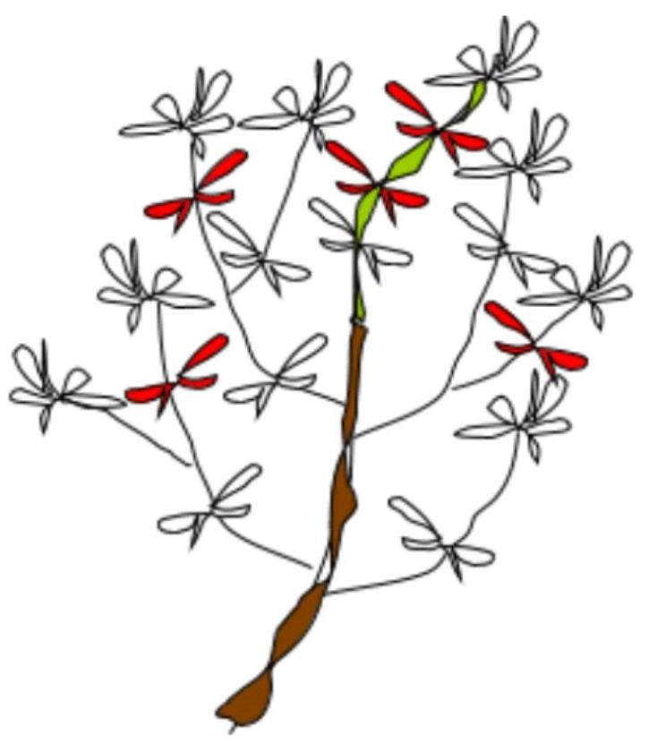

# **DesFert (CN DEP) Foliar CNP Analysis Protocol**

November 17, 2005

We want to measure the foliar C, N, and P content for *Larrea tridentata* and *Ambrosia deltoidea* or *A. dumosa* across the upwind, core, and downwind locations.

## **Field collection:**

1. Randomly choose 5 creosote and bursage plants in each of the 5 plots for every site (15 sites total). Do not choose shrubs chosen for ANPP measurements marked with A1 tags and/or flagging.

2. From each plant, randomly select one stem in each of 4 cardinal directions.

3. Clip the end of each stem with equal green and woody sections (at least 5 cm of woody section, and as much as we can get of the green section).

4. Place all stems per plot per species in a paper bag and keep cool with ice packs in cooler (you should have 20 stems per bag).

## **Lab processing:**  
(note: all leaves must be dried within 48 hours of collection)

1. For each plot, remove creosote or bursage stems from their bag and separated on the lab bench (wear gloves when handling samples).

2. From each clipped stem, pick 4 fully-developed leaf pairs from the green section of the primary stem. We are defining "fully-developed" leaves as those that are just behind the newest leaves (the newest leaves are the 2 undeveloped green ones plus the ones just attached to them). If there are less than 4 fully-developed leaves to choose from in the green section, pick all of the fully-developed ones that are available. Do not choose leaves that are farther bach down the stem or leaves that are brown and/or damaged.

3. Rinse all picked leaves from the green sections with DI water in a clean fine-meshed sieve and place in a coin envelope with the site name, species name (eventually, we'll have bursage too), plot name, date processed, and the label "Green".

4. From each woody section, choose 3 sub-stems. From each sub-stem, pick 2 fully-developed leaf pairs. Choose the first pair of fully-developed leaves back from the tip of each sub-stem. Do not choose leaves that are farther back down the stem or leaves that are brown.

5. Rinse all picked leaves from the woody sections with DI water in a clean fine-meshed sieve and place in a coin envelope with the site name, species name, plot name, date processed, and the label "Woody".

6. Dry all leaves in coin envelopes at 70 degrees Celsius for at least 48 hours before grinding.

**Figure 1. For example, you would choose the leaves that are marked in red (shaded).**

## **Litter grinding:**

1. Fill polycarb vial approximately 1/2 full with leaf litter.
   1. Add one of the polycarb balls and cap vial.
   2. Place vials in ball mill chamber and mill for 10 minutes. Be sure to mark the outside of the vial where the rough area is with the sample number and either G for "green" or W for "woody".

2. Next, make sure scale is calibrated and zeroed.
   1. Tar tin and then add sample to tin, re-weigh, and repeat until weight is 2g +/- 0.2g.
   2. Fold tin closed and place in well tray, record well number.

## **Foliar CHN analysis prep and processing:**

Samples are analyzed for C and N content on a Perkin-Elmer 2400 Series II CHNS/O Elemental Analyzer.  

In years when "Complete Analysis" is ordered for the PRS probes (every 3-5 years), then metals analysis should be included for the *Larrea* leaves. If funds are available, total C and N should be determined using the CHN analyzer at Goldwater. Samples for total P and metals should first be digested using the MARS microwave in Goldwater, then analyzed by ICP-MS in the Keck lab.

