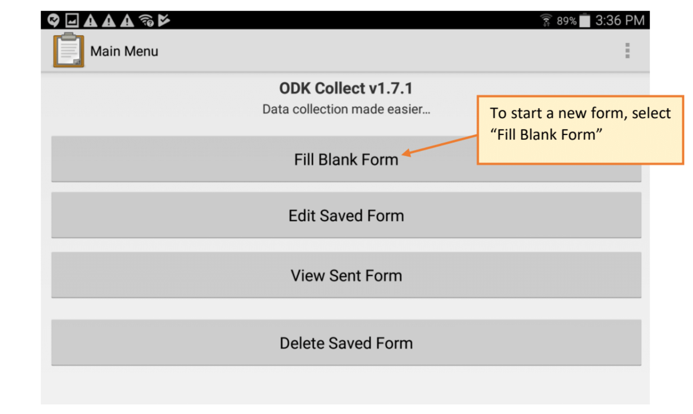

# **DesFert (CN DEP) Stems Elongation Protocol**

Last updated December 2019

* Stem length on select *Larrea* shrubs are measured twice per year - once in the fall and again in the spring.

* Five *Larrea* shrubs (designated L1 through L5) have been selected as study plants in each plot at all DesFert sites.

* Measurements are taken at 4 points on each study plant - one on a stem facing each of the cardinal directions.

* Each time the shrubs are measured, a new piece of colored lab tape is placed around the stem, which will be used as the point from which to measure stem elongation during the following period.

* Stem length data from tablet is uploaded to the CAPLTER Dropbox at Dropbox (ASU)\research\DesFert\cndep_stems_tablet_data

* __Tablet Protocol can be found below in Appendix 1.__

## **Supplies:**

* Two (2) Samsung tablets
* Scissors
* Sharpies
* Rolls of colored lab tape (the color used rotates each time new measurements are taken)
* Analog and/or digital calipers
* Pin flags
* Metal tree tags

## **Field Protocol:**

* Before arriving at the study site, cut one inch-wide tape into 1/4 inch-wide strips and loosely stick to back of clipboard. Cut enough strips for each direction on each plant (20 per plot). Label each piece with a plant number (L1-L5) on the left side of the tape and a cardinal direction (N, S, E, W) on the right side.

* Study plants are marked L1 through L5 with a silver tree tag. Pin flags, set temporarily into each plant, can also help to locate study plants while in the field. For each of the 5 study plants per plot:

1. Measure stem elongation:
   1. Look for a piece of colored tape in each cardinal direction of the shrub. Make sure the calipers are calibrated to zero and you are measuring in mm. Measure the stem (in mm) from the node directly above the piece of tape to the last node on the stem.
   2. If the stem branches at any point above the tape, measure each branch separately (Fig. 1) and record all the branch lengths in the tablet.
   3. Do not measure the stalks of flowers or fruits.
   4. If the leaves directly above or below a node have fallen off and the stem is not measurable, make a note in the tablet.
   5. If the tape can't be found, check on the ground around the shrub to see if the tape has fallen off or the branch has died. Note in the tablet if the tape is missing or the branch is dead.
   6. Remove the old tape from the stem.

2. Measure re-taped stem lengths:
   1. Re-tape the stem with a new piece of tape. Place the tape close to the end of the stem, but with a measurable internode between the tape and the end of the stem.
   2. Measure the re-taped stem lengths as above and record in the tablet.

**Figure 1. Branching stem."

## **Appendix 1: Tablet Protocol**

