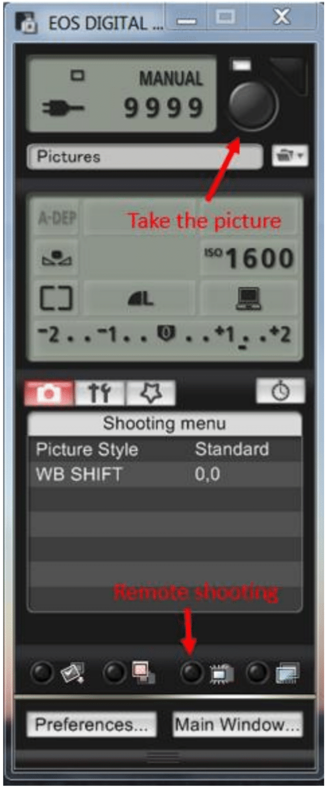

# ESCA Arthropod Sweep Net Lab Protocol

updated June 2020

## Workflow Overview

Once every five years, the CAP LTER Entomology Lab is responsible for receiving and processing sweep net samples from the nearly 200 Ecological Survey of Central Arizona (ESCA) sites across the Phoenix metropolitan area and surrounding Sonoran Desert. During February through June of the collection year, ESCA technicians collect three sweep net samples of vegetation-dwelling arthropods from the dominant plant species at each site, or from ground sweeps when only turf or weeds are present. Each sample is stored in a Qorpak jar and boxed jars are delivered to the lab periodically after collection. Once received, the CAP LTER Entomological Research Specialist should examine the jars to make sure all samples have been delivered and that all jars are sealed tightly to prevent evaporation of ethanol. The Research Specialist, with the help of a student worker, is responsible for separating out the arthropods from the debris in each jar and identifying the specimens to the lowest taxonomic level possible. Once identified, the samples are preserved in ethanol in a two-dram vial and stored indefinitely in the CAP LTER entomology lab.

## Student Worker Duties

* First, organize the sweep net jars received to ensure that the three samples from each site are together, so that work on each site can be completed at the same time. During the ESCA season, there will be a regular influx of samples to the lab, so organization from the beginning is key to success.

* Next, create a new sampling event sheet for each Qorpak jar sample. Use the information from the label in the jar to add the site ID, date collected and host plant to the top of the sheet. Each site should have three event sheets, which should be kept together throughout the process.

* Working on one jar at a time, place the label found in the Qorpak jar in a clean one-dram vial and fill the vial with ethanol.

* Each Qorpak sample jar will contain ethanol, arthropods and debris from the environment, which can include varying degrees of leaves, stems or even incomplete arthropod parts. Most samples will include more debris than can be cleared at once, so debris will need to be removed from the Qorpak jar in stages.

* Remove large debris, such as twigs and leaves, from the Qorpak jar using forceps and place debris in a petri dish. Examine the debris under a microscope at low magnification to check for arthropods, place those found in the one-dram vial. After taking special care to make sure no arthropods are trapped in the debris, especially on the leaves, the debris can be discarded. Depending on the amount of debris, repeat this step as necessary.

* Once most of the debris has been removed, pour the ethanol from the Qorpak jar into the petri dish and rinse the jar using an ethanol squeeze bottle to make sure all matter is extracted from the jar and moved into the petri dish. Under low magnification, remove the remaining debris while checking for arthropods, which can be left in the petri dish for the next step. Large arthropods can be transferred directly to the one-dram vial.

* Once the debris is removed, first search for arthropods on low magnification to remove larger specimens, and then increase the magnification to find smaller specimens. At higher magnification, two passes should be performed to ensure all arthropods have been successfully removed. Place all arthropods separated out from the debris in the previously labeled vial for this sweep net sample. Consult with the Research Specialist if there is any uncertainty about whether an item in the debris is actually a specimen, or err on the side of caution and include the item in the vial for later evaluation.

* Once all debris and specimens have been removed from the petri dish, pour the remaining ethanol into a hazardous waste container and place the jar in the sink to be washed. Assuming all three sweep net samples were collected, the result from each site will be three, one-dram vials with arthropods for the Research Specialist to identify.

## Expanded Student Worker Duties

* Once the student has gained experience and is comfortable with the process above, the Research Specialist should teach the student how to identify the groups commonly found in abundant numbers in the samples. At the minimum, these groups will include Collembola and Acari, as identification is done only to the Family level and having to sort through these samples twice (once by the student and once by the Research Specialist) is unnecessarily time-consuming and redundant. Keys and specimen images from a student-specific Dropbox folder should be shared with the student to aid them in identifications. So as not to overwhelm the student, it is best to share this folder in increments as their identification skills progress.

* In some groups, such as Collembola, there may be hundreds of specimens per jar. Once a significant number of specimens is present (~100), sample a subset to count the specimens. Divide the petri dishes into four quadrants, count the number of individuals in one quadrant and multiply by four. Ensure that the specimens are evenly distributed to get the most accurate count.

* Upon identification of the first samples from a site, which will generally be the groups identified by the student, use a fourth vial, this time a two-dram vial, to store all the identified specimens from each site. Create a label for this vial containing the site, number of sweep net samples included (e.g., #1-3), date collected, Research Specialist's name and the year the sample was identified. Before adding specimens, place this label into the vial, but along the outer edge so that it can be read from the outside.

* The student worker is responsible for adding their identifications onto the ESCA datasheets prepared earlier.

* Student workers will also help the Research Specialist by entering ESCA data into the database.

## Research Specialist Duties

* Ideally, the Research Specialist should spend their time identifying the unknown samples separated out by the student, but at the start of the project and periodically thereafter, will have to aid with sorting arthropods from the debris and, in this case, should follow the student protocol.

* If the student has not started a two-dram vial to store all the identified specimens from the site, follow the instructions above for labeling this vial.

* To begin the identification process, collect the datasheets created by the student for the specific site and review the student notes to ensure all vials are present. Notes such as "empty" or "jar missing" would explain a case where there are less than three vials for a site.

* Working on one vial at a time, empty the specimens out of the vial and into a petri dish, rinse the vial with ethanol and ensure that all specimens have been removed and that none are stuck to the label.

* When identifying and counting specimens, do not count exoskeletons or random head capsules, wings, legs etc., but do count pieces of arthropods when the majority of the specimen is present.

* If the jar has been sorted correctly, there will only be arthropods in the petri dish, but always check for any extraneous material and remove it from the dish. Using written or online identification keys, begin identifying specimens. Remove the larger specimens first to identify, as they may hide smaller specimens underneath them. For example, identify beetles first, then ants and finally groups like Collembola and Acari. When identifying groups that are less familiar, sort the groups out initially and identify multiple species at once to become familiar with new keys.

* Use images of past identifications, which are stored in the Entomology Lab Dropbox, to verify an identification. For species without images on file, use the SCAN Symbiota database or BugGuide.net to access images for identification confirmation.

* In some groups, such as Collembola, there may be hundreds of specimens per jar. Once a significant number of specimens is present (~100), sample a subset to count the specimens. Divide the petri dishes into four quadrants, count the number of individuals in one quadrant and multiply by four. Ensure that the specimens are evenly distributed to get the most accurate count.

* As the specimens are identified, add the lowest taxonomic rank and their specimen counts to the datasheet created by the student worker and place the specimens into the two-dram vial. Each two-dram vial will hold all the specimens from a site.

* Once all the specimens from a site have been identified, store the two-dram vial with all others from the project, arranged in alphabetical order by site name.

## Camera

* Use the camera to create images of new arthropod identification. To use the camera, connect the USB cord to the computer and turn the camera on. 

* Using the program EOS Utility, click on the icon and select the third option "Camera setting/remote shooting", which will open a new window shown in Figure 1 (below). Towards the bottom of that window, there is a row of four icons. Select the third icon, which looks like a box with lines radiating out from it, and a window for remote shooting will open.

* On the back of the microscope, push in the silver piece to close the eye piece and the image will appear on the computer screen. Zoom in to allow you to best focus the image.

* Click on the large button on the window shown to the right to take the picture, which is automatically saved into the My Pictures folder. Rename the picture including size, site, and sample date.

* Use photo editing software to improve the picture if needed.

**Figure 1: EOS Utility Camera Setting/Remote Shooting**
