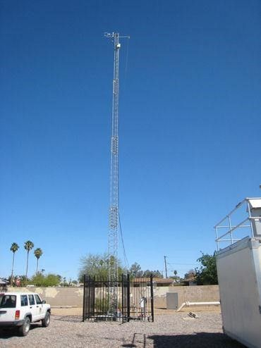
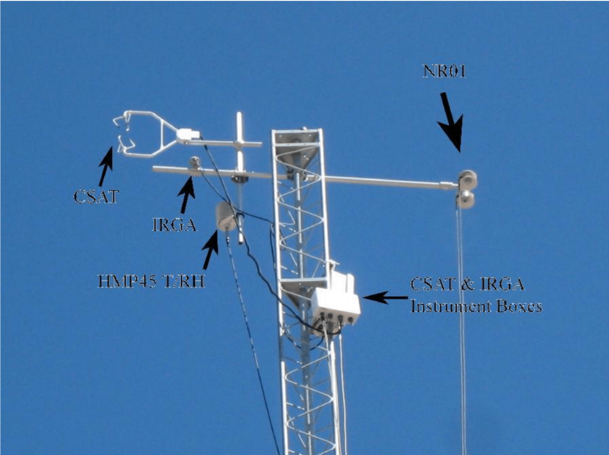

# Fieldwork Protocol for CAP-LTER West Phoenix/Maryvale Flux Tower

Prepared by Winston Chow and Thomas J. Volo
Last Update: August 30, 2014
Slight update by Sally Wittlinger: May 13, 2020

**Figure 1: The Maryvale/WPHX Eddy Flux Tower**



### Introduction

* This document is a guide, including a list of field operator protocols for a micro-meteorological Open Path Eddy Covariance (OPEC) tower located at the SE corner of Earll Drive and 39th Ave in Phoenix within the Maryvale area (lat/long 33.483847&deg;, -112.142609&deg;).

* The site is owned by the City of Phoenix, Water Services Department. There is an existing 10m tower and a suite of instruments onsite that are both operated by Maricopa County Air Quality Department (contact: Ron Pope, RPope@mail.maricopa.gov).

* The tower (a 72ft-tall US Tower TX-472) is sited within a fenced-off compound, with a combination number lock (Figure 1). The compound itself is also part of a larger enclosed area, which is secured by a daisy-chain of locks. ASU's is the grey Masterlock. The security combination for both gates can be obtained by contacting Quincy Stewart, CAP-LTER Research Specialist Sr. (Quincy.Stewart@asu.edu).

   * Field operators, note how to correctly daisy-chain the exterior locks properly so as not to inconvenience other operators at the tower site.


### Tower's Scientific Function

* The instruments installed on the tower and at the surface obtain a comprehensive picture of surface and near-surface climate, carbon and energy characteristics for a residential suburb located in an arid hot climate through the eddy covariance technique.

   * These data are valuable for numerous purposes, which include model validation, time-series analyses of carbon and eddy fluxes etc.

   * The tower has also been listed on the Urban Fluxnet website (http://www.geog.ubc.ca/urbanflux/) along with other urban OPEC sites.

* The on-site instruments (and their function) can be seen in Table 1; the wiring list for all instruments can be viewed in Appendix A.


Table 1: Instrument list at tower

**Instrument (Quantity)** | **Variables measured** | **Purpose**
--- | --- | ---
*At 72 feet above surface level* | - | -
Sonic anemometer (1) | 3-dimensional wind-speed | High-frequency (10Hz) sampling of turbulence, moisture, carbon dioxide and air temperatures for urban eddy covariance of residential neighborhood in Maryvale
Infra-red gas analyzer (1) | Water vapor, carbon dioxide | -
Temperature/relative humidity sensor (1) | Air temperature, relative humidity | -
Net radiometer (1) | Shortwave and long-wave radiation | Measurement of incoming and outgoing surface radiation of neighborhood surface
*At surface and sub-surface level | - | -
Soil temperature sensors (3) Prior to May 2016 | Soil temperature and moisture from surface to 30cm depth | Sampling of temperature and moisture profiles of representative neighborhood soil type
Soil moisture sensors (3) Prior to May 2016 | - | - 
Soil heat flux plate (1) Prior to May 2016 | Surface heat fluxes of bare, sandy soils | Point measurements of heat fluxes of representative neighborhood soil type
Rain gauge (1) | Precipitation | Measures on-site rainfall


* A total of three dataloggers are used on-site to record and store instrument data; two CR1000s and one CR23X. One CR1000 is for the OPEC sensors, while the other is for the suite of ground sensors (currently not in use). The CR23X programs and records data from the radiometer and the rain gauge. Data from the OPEC CR1000 is collected via a compact flash (CF) card. Data from the other two sensors is sent remotely and automatically to an ftp.

* Power for the tower is obtained from main cables on-site and is linked to an outlet within the datalogger enclosure. A PS100 regulator powers each of the CR23X and the CR1000 with the soil sensors loggers. A standard laptop charger is also connected to a 12V marine/auto battery used to initiate the infra-red gas analyzer (IRGA) and power the OPEC sensors and their CR1000 datalogger (see LI-COR operator manual for more details).


### Maintenance

* For those new to OPEC, I **strongly encourage** the operator to attend an OPEC course for familiarization with the instrumentation and protocols involved. I suggest either the Campbell Scientific OPEC operator workshop held at its HQ in Logan, Utah (http://www.campbellsci.com/training), or a two week summer workshop organized by FLUXNET on a periodic basis (http://fluxney.ornl.gov/meetings-workshops).

* If not, at the very least, he/she should be well-versed in using the OPEC operator manual (http://s.campbellsci.com/documents/us/manuals/opecsystem.pdf), using the CSI LoggerNet program, as well as the manuals for each instrument (https://www.campbellsci.com/manuals) for more information in order to troubleshoot any issues.

* All hardware (e.g. tower winching tool), tools (e.g. screwdrivers, wrenches, Allen keys, wire cutters, chalk bag, inclinometer, tape measure etc.), carrying cases (for the sonic anemometer, infra-red gas analyzer, net radiometer etc.), climbing equipment (harness, quick draws, karabiners, gloves, helmet) and tower-specific fieldwork tools are in the CAP-LTER lab in Glodwater Center (GWC681) on the ASU Tempe Campus.

* Please contact Quincy Stewart (Quincy.Stewart@asu.edu) or Zhihua Wang (zhwang@asu.edu) if you have further issues with any of the tower instruments.


### Monthly Maintenance and Data Retrieval

* Visually inspect the tower and instruments - both on the tower and below ground - to determine if there are obvious issues of note. The site is exposed to petty vandalism on a regular basis, but no tagging or sabotage to the tower itself has occurred. In May 2016, vandals cut the wires to the ground sensors, leaving the sensors useless. All ground sensors were removed at this time.

* Ensure that the rain gauge is standing vertically and the screen is free of debris that could impede measurements.

* Check voltage of marine battery with multimeter to ensure adequate power supply; ideally, all voltages should be ~12V. Ensure that the cover to the battery storage box is secure.

   * If the marine battery is much below 12 volts (~9V or less), the IRGA chopper will NOT work and will be flagged. There is a spare CAP-LTER marine battery stored in GWC681. Three have been problems in the past due to an insufficient power supply, particularly as the power requirements of the IRGA increase with higher temperature. A standard laptop charger was installed to provide more power (5A @ 12V) than the previous setup, which included a PS100 charging regulator (only 1A @ 12V). The charger is not necessarily rated for outdoor use, but power has been consistently high enough to keep the IRGA running.

* Retrieve 10Hz data from CR1000 through NL 115 memory card port.   

1. Press and hold the white button on the NL 115. Once the light turns green, unscrew the port door and push the black eject button to remove the memory card. Insert an empty memory card and close the door.

   * Raw data are in TOB3 (i.e. binary) format, and need to be converted to other formats through LoggerNet.   
   * The CF cards are industrial grade to withstand temperatures up to 85&deg; C; regular grade CF cards will not work at the site. In fact, the only CF cards that will work are those sold by Campbell Scientific.   
   * I suggest that data transfer for the eddy flux data be done at the lab due to the time taken for data conversion to TOB1 format.

2. <mark>For data conversion, attach the USB multi-card reader to laptop and insert card. Open the CConvert button in LoggerNet. There should be two different files: one with 30min block averaged data, the other much larger file with 10Hz data. Click on "Start Conversion" to initiate the process. Several weeks of data can take 30-45 minutes to convert.</mark>

3. Once the TOB1 files can be seen on the laptop, fully delete the files from the card. The card can now be used in the NL 115 again. Be sure to eject the drive before removing either the card or the card reader!!


### Removing IRGA (LI-COP 7500) for Calibration in the Lab

* This should be done annually with a scrub bottle kit (part# 7500-950), which can be ordered from LI-COR. Contact Enrique Vivoni at ASU (vivoni@asu.edu) to set up a time for one of his graduate students to assist in the calibration.

* Take note of the orientation of each instrument on the tower in Figure 2. Removing (and installing) each sensor from the tower is a complicated process which requires much care due to the precarious nature of this fieldwork, combined with the cost of the equipment and the tower:

1. The operator should attend the ASU Fall Safety course prior to climbing the tower. Sign up for EHS Fall Protection - Safety at Heights through ASU Career EDGE.

2. Remember to bring all the necessary fieldwork items and carrying cases prior to departure, and I recommend leaving for the site as early as possible (especially in summer). CAP-LTER field safety protocols also apply.

**Figure 2: The instrumentation at the top of the tower**


3. To lower the tower, first remove the cables from the Velcro strip at the base of the tower. Locate the winching mechanism on the NW corner of the tower. Remove the nut and insert the winching arm into the mount; rotate counter-clockwise (cable out) to lower and clockwise (cable in) to raise the tower.

   1. DO NOT LOWER TOWER BELOW 40 FEET AS IT WILL DAMAGE THE INSTRUMENT BOXES MOUNTED ON THE TOWER. There are clear duct tap markings on the tower base to indicate where the tower's inner section should be at 40 feet.

4. You will need to bring with you up the tower: a small bag for easy access to tools and hardware storage (chalk bag); quick-draws on your harness to secure yourself to the tower; a 1/2-inch wrench; a karabiner or large bag to carry down the IRGA interface box; a small backpack for the IRGA; Allen wrenches (the middle one in the set in the toolbox, but I usually bring up the whole set because it's easier to grab in the bag); a cloth and either water or Windex (or some other cleaner) to clean the net radiometer.

5. Use the Allen wrench to remove the IRGA's Nu-Rail assembly from the boom arm. Place the IRGA in the backpack, then remove the cable from it by pulling firmly.

6. Take the opportunity to clean all four windows of the net radiometer.

7. Remove the SDM and power cables from the IRGA interface box and let them dangle from the Hub. The only cable attached to the box should be the one you already unplugged from the sensor head in step 4. Remove the IRGA interface box with the 1/2-inch wrench. Loosen the two upper U-bolts first, then remove one, but resecure the U-bolt to the box without attaching it to the tower. Use a karabiner to hand that U-bolt from a tower strut. After removing the other two U-bolts and allowing the box to hang from the strut via the karabiner, you can then easily transfer the box frmo the strut to a loop on your harness via the karabiner.

8. Place the IRGA in its carrier case for transport back to campus. THe calibration process requires the IRGA, the interface box, the cable between them, and a power cable. We have purchased an additional power cable to avoid disconnecting it from the Hub for calibration. Be sure to take the winch handle with you whenever you leave the tower!

9. To reinstall, reverse steps 5 and 7 above. The IRGA should be installed ~40cm from the CSAT, at an angle of ~30&deg; from the vertical to allow water to drip from the sensor windows.

10. On the ground, connect the laptop to the CR1000 using the RS-232 cable with USB adaptor. In LoggerNet, click on the "Connect" icon and "Connect" to the "CR1000". Check the Numeric Display #1 to make sure data values are shown (no NAN's) and all flags show "false".

11. Once everything looks good, extend the tower to its full height (72 ft). You should hear a ratcheting sound while turning the winch. Ensure that the cables are not stuck on obstructions while raising the tower. The cables from the CSAT box to the hub should be on the south side of the tower to help avoid obstructions. The height of instruments can be checked with an inclinometer, a tape measure, and a bit of basic trigonometry. Secure all five cables (2 to the Hub, 2 to the radiometer, 1 to the T/RH probe) to the base of the tower with the Velcro strip.

* Generally, re-installation takes more time than instrument removal due to the additional attention needed to install each sensor. Do fact the additional time needed (~1 hour) in your fieldwork plans.


### Routine Field Maintenance

* All four windows of the net radiometer should be cleaned quarterly. Follow the procedure for lowering and raising the tower as described above.


### Other (Non-Routine) Field Maintenance

* See the Calibration Record in Confluence to determine when sensors are due for calibration.

* Removing other instruments from the tower: follow similar procedures as removing the IRGA as described above.

   * The CSAT is also fixed to a vertical beam by a Nu-rail; similarly remove the assembly with the correct Allen key and sliding it vertically.   
   * The net radiometer can be removed by loosening the housing from the beam with an Allen key and sliding it out horizontally.   
   * The Temperature/Relative Humidity (T/RH) sensor is in two parts. The sensor itself can be removed by unscrewing it from the bottom of its radiation shield, while the shield itself is removed by unscrewing the mount with the appropriate wrench.   
   * I suggest using cable ties to shorten the cables of each instrument (especially the net radiometer and the T/RH sensor prior to removal).   
   * Use the level indicators installed in both the net radiometer and CSAT to ensure that the instruments are properly aligned with the ground during installation.   
   * The SDM-Hub is attached to the tower with a large karabiner. It may look insecure, but a manual check (jiggling) will show that it is much stronger than it looks, and through several years it has not fallen. A Phillips screwdriver is needed to open the box, and the cover only fits on the hub in one direction (text on cover should appear upside-down). To remove or insert cables, use the small flathead screwdriver in the spare parts box. The screwdriver must be inserted vertically in the small hole next to the lead port. If the lead does remove easily or will not secure when the screwdriver is retracted, keep pushing the screwdriver further. It's not as easy as it probably should be. Don't be afraid of pushing the screwdriver all the way to the back of the box.

* Direct connect to the dataloggers

   * Since the data from two dataloggers is transferred through the county's wireless network, and the other datalogger uses the CF card, you should not generally need to connect to the dataloggers remotely.   
   * If you do need to connect, use the "Connect" icon from the main LoggerNet toolbar and connect the laptop to the dataloggers RS-232 port using the serial/USB adapter.   
   * Check to see if COM port is enabled on LoggerNet software; this can be done by clicking on the "Setup" button and seeing if the "Communications Enabled" box is checked; there should be a valid COM Port connection listed.   
   * Clicking the "Connect" icon on the main toolbar will open up a Connect screen window.   
   * Select the appropriate station datalogger (CR1000, CR1000_soil, or CR23XPB). The loggers with names ending with a "2" are for remote connection via the internet, but these are no longer used either. Should you have issues with the remote connection, access the dataloggers through LoggerNet on the ASU server.   
   * When you connect, you should see a visual of connected plugs showing the direct link, as well as the elapsed connection time start upon a proper connection.   
   * Ensure that the time between the station and the laptop are synchronized by clicking the "Set Datalogger Clk" button.   
   * Click on the numeric display buttons (default - button 1) to check on the logger status, as well as see real-time data.


### Data Management

* Data is being stored and transferred through an ftp site established at ASU: <mark>ftp.dev.gios.asu.edu:5000</mark>. The username is <mark>"fluxtower"</mark> and the password is <mark>d3184fac6553</mark>. The site contains two folders, one for raw data, and another for processed data.

* The 30 min data files are being automatically uploaded to the raw data folder. To do this, LoggerNet is running continually on an ASU server: suscon.tsc.asu.edu. So long as the main LoggerNet window is open on the server, the downloads should occur. To access the server, open a remote desktop window (search for Remote Desktop Connection in Windows) and use the username <mark>"tvolo"</mark> and the password <mark>"loggernet"</mark>. The data is being downloaded to the server daily at 2:05am, then pushed to the ftp automatically at 2:22am. LoggerNet is set to append the new data to the existing file on the server, then the push script replaces the existing file on the ftp with what is on the server. The three files, each in its respective folder, are CR23XPB_30_MINUTE_DATA.dat, CR1000Soil_Soil.dat, and CR1000_flux.dat.

   * These files should be checked at least weekly to ensure continuous data, i.e. that the daily uploads to the ftp are working (potential problem with server or push script), the daily downloads from the datalogger are working (Is LoggerNet open on the server? Other potential problems with network or connections) and that the data files do not contain NAN's (problems with tower instruments). If the last data entry shows numbers for today, then everything is good.   
   * These folders also contain files with data prior to the most recently pushed file. The dates of the data within are included in the names of the files. The most recent of these files has "current" in the name to indicate this has the most recent data, excluding the newest data from the last pushed file. If the pushed file has been checked as described above, and the first data entry matches that of the "current" file, the "current" file should be overwritten with the pushed file. This creates a backup in the folder in case anything goes wrong with the push, but also keeps the data in one continuous file.

* <mark>Data downloaded from the CF cards during site visits need to be manually uploaded to the ftp, but it first needs to be converted to a readable format.</mark>

   * <mark>When the CConvert tool in LoggerNet is used to save the files from the CF cards, two files should land in the Campbellsci/Data_tower folder on the laptop: one with the 30min data (_flux), and another with 10Hz data (_ts). These are both in binary (TOB1) format.</mark>   
   * The 30min data is the same as that telemetered to the ftp automatically each night. Thus it is not absolutely necessary to collect this data manually through the CF card as well. However, it could be handy to have the smaller 30min file (<1MB) with the same date/time range as the larger 10Hz file (>1GB) to quickly check the quality and consistency of the data without having to open or convert the much larger file.   
   * Click the <mark>"View"</mark> icon in the LoggerNet toolbar and open the TOB1 _flux file. The program will ask if a further conversion to TOA5 format is needed. Click on yes, and the data will be converted to a format viewable by the LoggerNet "view" program, MS Excel, MATLAB, etc. This relatively small file should be easily viewable in LoggerNet "View".   
   * The 10Hz data will take quite some time to convert to TOA5, and trying to do anything else while the conversion is taking place may cause problems. Furthermore, actually displaying the data in the View screen may crash the program. Thus the 30min files can be useful for viewing to check the quality of the data, but the 10Hz files still need to be converted to TOA5.   
   The 10Hz and 30min files (both TOA5 and TOB1) should then be uploaded to the ftp in their respective folders so they can be accessed for processing. Due to its size, the 10Hz data should be periodically moved from the laptop and backed up externally.

* All raw data is stored with Stevan Earl (stevan.earl@asu.edu), CAP-LTER Information Manager.

* Post-processing of the raw 10Hz data should be done off-line with a dedicated eddy covariance software program (e.g. EDiRE, EddyPro) or with an appropriate MATLAB script. Processed data can go in the "Processed" folder on the ftp for storage and eventual publication.

* Should LoggerNet need to be reset or reconfigured to download the data, please see the Telemetry Access Instructions included in Appendix B of this manual. Questions about the server, ftp, or push script can go to Stevan Earl (stevan.earl@asu.edu).


### Programs for each datalogger

* There are three separate programs used at the site installed each datalogger

   * Program for eddy flux sensors on CR1000   
   * Program for soil sensors on CR1000 (not currently in use)   
   * Program for radiation & rain gauge sensors on CR23X

* Each program's code is installed in the GIOS laptop. Please contact Winston Chow (winstonchow@nus.edu.sg) for further details of the code, and/or installation instruction for the datalogger(s) (especially if one is unfamiliar with LoggerNet).

* The following is a sample from the CR1000 program for the OPEN sensors (written in CSBasic):

```
'CR1000 Series Datalogger
'date: Jan 7 2011
'program author: Winston Chow

' This datalogger program measures turbulence sensors at 10. The time series is saved to a card. The datalogger will also compute online turbulent fluxes from the measured data. The flux table saves all the cross products that are required to rotate the online fluxes into natural wind coordinates in post processing as described in Kaimal and Finnigan (1994), and Tanner and Thurtell (1969).
'The following sensors are measured:
'
'CSAT3         three dimensional sonic anemometer
'LI-7500       open path infrared gas analyzer (CO2 and H2O)
'HMP45C        temperature and relative humidity probe
' The sign convention for the fluxes is positive away from the surface and negative towards the surface.
' The datalogger will introduce lags into the CSAT3, LI-7500, and datalogger
`Panel Temperature data so that all measurements are aligned in time. The
`lags are a function of the Scan Interval and are computed automatically by
`the program.
' The site attendant must load in several constants and calibration values.

'*** Unit Definitions ***

'Units      Units
'C          Celsius
'degrees    degrees (angle)
'g          grams
'J          Joules
'kg         kilograms
'kPa        kiloPascals
'm          meters
'mg         milligrams
'mmol       millimoles
'mol        moles
's          seconds
'umol       micromols
'V          volts
'W          watts

'*** Wiring ***

'SDM INPUT
'SDM-C1     CSAT3 SDM Data (green)
'           LI-7500 SDM Data (gray)
'SDM-C2     CSAT3 SDM Clock (white)
'           LI-7500 SDM Clock (blue)
'SDM-C3     CSAT3 SDM Enable (brown)
'           LI-7500 SDM Enable (brown)
```

# Appendix A: 

### Wiring list for OPEC instruments on CR1000

**Instruments**

* CSAT 3d sonic anemometer
* LI-7500 CO2/H2O infra-red gas analyzer (IRGA)
* HC2S3 T/RH sensor
* CR1000 datalogger
* PS100 power regulator
* 12V DC marine battery

**CR1000 port** | **Wiring**
--- | ---
SDM - C1 | Hub Blue
SDM - C2 | Hub Yellow
SDM - C3 | Hub Green
Ground | Hub Black (Do not insert with Hub Red into same port!)
Ground | Hub Red (Do not insert with Hub Black into same port!)
1H | HMP45 yellow
1L | Jumper wire to 2L
2H | HMP45 blue
2L | HMP45 white & jumper to 1L
Ground | HMP45 black & shield
12V | HMP45 red
**Marine battery | - 
12 V (positive) | Hub Power Red (thicker gage wire)
Ground | Hub Black and Clear (thicker gage wire)


### Wiring for SDM Hub8

**Left hand side** | **Right hand side**
--- | ---
*SDM cables* | -
CSAT green & 7500 gray | Blue
CSAT white & 7500 blue | Yellow
CSAT brown & 7500 brown | Green
CSAT clear & 7500 white | Black
CSAT black & 7500 black | Red
*Power cables* | -
CSAT red & 7500 red/white | Red
CSAT black & 7500 green | Black
Empty | Clear


### Wiring for CR23X

**Instruments**

* Hukseflux NR01 four-component net radiometer
* TB4 rain gage

**CR 23X port** | **Wiring**
--- | ---
1H | NR01 Cable 1 Red
1L | NR01 Cable 1 Blue & Jumper to G
G | Jumper to 1L
2H | NR01 Cable 1 White
2L | NR01 Cable 1 Green & Jumper to G
G | Jumper to 2L
3H | NR01 Cable 1 Brown
3L | NR01 Cable 1 Yellow & Jumper to G
G | Jumper to 3L
4H | NR01 Cable 1 Purple
4L | NR01 Cable 1 Gray & Jumper to G
G | Jumper to 4L
G | NR01 Cable 1 Shield
5H | Black attachment - cable to EX1
5L | Black attachment - NR01 Cable 2 Red into BA L
G | Black attachment - NR01 Cable 2 Blue into BA G
6H | NR01 Cable 2 White
6L | NR01 Cable 2 Green
- | Other NR01 Cable 2 wires are free
G | TB4 Clear and White
P1 | TB4 Black


### Wiring list on CR1000 for soil sensors

**Instruments (soil sensors not currently installed)

* 3x CS616 water content reflectometers
* 2x Hukseflux HFP01-SC
* 4x TCAV soil thermocouples
* CR1000 datalogger

**CR1000 port** | **Wiring**
--- | ---
1H | CS616 Green (top sensor)
1L | CS616 Green (middle sensor)
Ground | CS616 Black (top and middle sensors)
2H | CS616 Green (bottom sensor)
Ground | CS616 Black (bottom sensor)
3H | TCAV Purple (2cm depth)
3L | TCAV Orange (2cm depth)
Ground | TCAV Clear (2cm depth)
4H | TCAV Purple (5cm depth)
4L | TCAV Orange (5cm depth)
Ground | TCAV Clear (5cm depth)
5H | TCAV Purple (15cm depth)
5L | TCAV Orange (15cm depth)
Ground | TCAV Clear (15cm depth)
6H | TCAV Purple (30cm depth)
6L | TCAV Orange (30cm depth)
Ground | TCAV Clear (30cm depth)
7H | HFP01 (Soil 2cm) White
7L | HFP01 (Soil 2cm) Yellow
Ground | HFP01 (Soil 2cm) Purple, Green, Shield
8H | HFP01 (Gravel 2cm) White
8L | HFP01 (Gravel 2cm) Yellow
Ground | HFP01 (Gravel 2cm) Purple, Green, Shield
C1 | CS616 Orange (top sensor)
C2 | CS616 Orange (middle sensor)
C3 | CS616 Orange (bottom sensor)
12V (multiple) | All CS616 Red
Ground (multiple) | All CS616 Shield/Clear
SW12V | Both HFP01 Red
Ground (multiple) | Both HFP01 Black and Clear


# Appendix B: Telemetry Access Instructions

LoggerNet is already running on an ASU server with these configurations already established. If the server loses power temporarily or is reset in some other way, simply opening LoggerNet should allow the program to make the next scheduled download at 2:05am. These instructions should therefore only be used in the event that the server is replaced or a new instance of LoggerNet is being used. They could be used to access the data from any computer with an internet connection, but that is not advised since that may interrupt the continuity of the data at the primary collection point (the ASU server and the ftp site).


1. In a LoggerNet window, click on the Setup icon.

2. Add a new root (should be an icon for it), and click through to add "IPPort", "PakBusPort" and "CR1000". Repeat to get a second CR1000 up. Repeat for a third logger, but instead of "CR1000", click "pbRouter" and "CR23XPB".

3. Settings for CR1000 with soil data (soil moisture sensors, heat flux plate, soil temperature probes):

   1. IPPort
      1. Communication enabled
      2. IP Address: 166.161.187.36:9883

   2. PakBusPort
      1. Communication enabled
      2. PakBux Port Always Open (if applicable)

   3. CR1000
      1. Communication enabled
      2. PakBux Address: 1001

4. Settings for CR1000 with EC data (IRGA, CSAT, HMP, battery voltage):

   1. IPPort
      1. Communication enabled
      2. IP Address: 166.161.187.36:9884

   2. PakBusPort
      1. Communication enabled
      2. PakBus Port Always Open (if applicable)

   3. CR1000
      1. Communication enabled
      2. PakBus Address: 1002

5. Settings for CR23XPB (net radiometer, rain gauge)

   1. IPPort
      1. Communication enabled
      2. IP Address: 166.161.187.36:9882

   2. PakBusPort
      1. Communication enabled
      2. PakBus Port Always Open (if applicable)

   3. CR23XPB
      1. Communication enabled
      2. PakBus Address: 1


