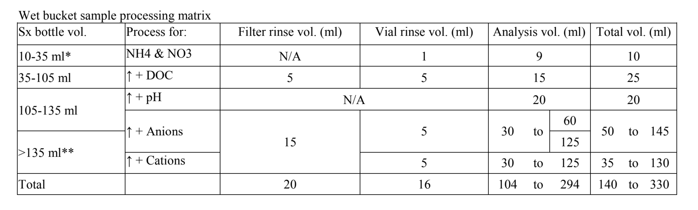

# caplter-research-protocols
Repository of CAP LTER field and lab protocols for long-term monitoring projects


### Make changes:
* Update location of key to LSA roof in ADP protocols   
* Add Flux Tower once revised


## Github Markdown Cheat Sheet:

Use these tips to help you make edits to the Markdown files. For more Markdown tips, check out [this link](https://github.com/adam-p/markdown-here/wiki/Markdown-Cheatsheet).


### Headers

```
# Use one pound sign for the title heading at the top of each protocol. (Header 1)
## Use two pound signs for each main heading in the protocols. (Header 2)
### Use three pound signs for subheadings. (Header 3)
```
# Header 1
## Header 2
### Header 3


### Bold/Italic

```
Surround text with two asterisks or underscores to make it **bold**.
```
Surround text with two asterisks to make it **bold**.

```
Surround text with one asterisk to make it _italic_.
```
Surround text with one asterisk to make it _italic_.

```
Combine the two for _**bold italic**_.
```
Combine the two for _**bold italic**_.


### Lists

```
1. Use this syntax for a numbered list.
2. Second item.
2. Number order doesn't matter.
   1. Use three leading spaces to add a nested list.
   2. Like this.
4. Back to the list.
```
1. Use this syntax for a numbered list.
2. Second item.
2. Number order doesn't matter.
   1. Use three leading spaces to add a nested list.
   2. Like this.
4. Back to the list.

```
* Use this syntax for a bulleted list.
* Asterisks, pluses, and dashes can be used as bullets.
+ Github will group different bullets into different lists.
+ Notice the spacing above.
   + Use three leading spaces to add a nested list.
+ Back to the list.
```
* Use this syntax for a bulleted list.
* Asterisks, pluses, and dashes can be used as bullets.
+ Github will group different bullets into different lists.
+ Notice the spacing above.
   + Use three leading spaces to add a nested list.
+ Back to the list.


### Links (and Line Breaks)

Use the following syntax to insert links.

```
[Link 1: Inline-style link](https://www.google.com)   <- three trailing spaces
[Link 2: Inline-style link w/ title](https://www.google.com "Google")

Link 3, the URL itself: https://www.google.com
```
[Link 1: Inline-style link](https://www.google.com)   
[Link 2: Inline-style link w/ title](https://www.google.com "Google")

Link 3, the URL itself: https://www.google.com


Note that the first two links are grouped together in the same paragraph, while the third link begins a separate paragraph. This is due to the number of newlines between each link.  Between Link 1 and Link 2, there is only one newline, while between Link 2 and Link 3, there are 2 newlines. 

If you want to separate two lines within the same paragraph (using only 1 newline), add three trailing spaces to the end of the first line. Otherwise, Github will not separate them.

Example:
```
These lines have no trailing spaces.
Github won't separate them.

These lines have three trailing spaces.   <- three trailing spaces
This will be written as a new line in the same paragraph.
```
These lines have no trailing spaces.
Github won't separate them.

These lines have three trailing spaces.   
This will be written as a new line in the same paragraph.


### Images

Use the following syntax to insert an image.

```

```

The link can either be a web link or a relative path to an image in the Github repository. Links are cap-sensitive.

```



```


### Subscript/Superscript

```
To write text in subscript, surround it with the <sub>html sub tag</sub>.
```
To write text in subscript, surround it with the <sub>html sub tag</sub>.

```
For superscript, surround the text with the <sup>html sup tag</sup>.
```
For superscript, surround the text with the <sup>html sup tag</sup>.

```
H<sub>2</sub>O
e=mc<sup>2</sup>
```
H<sub>2</sub>O
e=mc<sup>2</sup>


### Symbols

You can insert symbols in Github Markdown using character entities. To do this, use the following syntax: an ampersand, the character entity code, and a semicolon. Here are some of the most common ones used in the protocols; for a more extensive list, see [this link](https://dev.w3.org/html5/html-author/charref).

```
&plusmn;
&Delta;
&theta;
&mu;
&pi;
&ge;
&le;
&rarr;
```
&plusmn;
&Delta;
&theta;
&mu;
&pi;
&ge;
&le;
&rarr;

