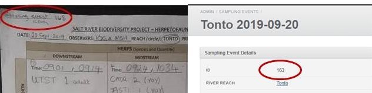

# **SRBP Herp Data Entry Protocol**

Revised December 2017

* Read the herp survey protocol to understand how the data were collected and how the datasheet was filled out.

* Click on "Sampling Events" for a list of the survey dates that have been entered previously. A morning doing surveys at a particular reach is a sampling event. Click on "New Sampling Event" to begin entering a new survey date.

* Select a "River reach" (of seven), enter an "Observation date", and input all information from the "Comments" section of the datasheet into "Sampling events notes". You can separate different comments with a semicolon. Click "Create Sampling Event".

* A sampling event observation is equivalent to a "Reach-level Observation" on the datasheet. Click on "add a new sampling events observation" to enter the herps.

* Select a "Herp taxon", enter a "Quantity", and enter any "Sampling events observation notes" associated with that taxon. You can separate different comments with a semicolon. Continue for each observation.

* To add both observers for the survey, click on "add a new observer", select the appropriate initials, and click "Create Observer". Repeat for the second observer. Contact the database administrator if a new surveyor's initials need to be added to the dropdown menu.

* Click on "add a new survey" to enter the first of the nine surveys. It is useful to input them in the chronological order they were surveyed, but this is not required.

* Enter the "Plot location", "Time start", "Time end", and any "Survey notes" associated with that particular survey. You can separate different comments with a semicolon. Click "Create Survey".

* For that new survey entry, click "go here" to input the herp observations. Click "add a new survey observation". Identical to entering a sampling events observation, select a "Herp taxon", enter a "Quantity", and enter any "Surveys observation notes" associated with that taxon. You can separate different comments with a semicolon. Click "Create Surveys observation". Continue for each observation.

* To move to the next of nine surveys, Click "Sampling Events" then click on the unique "ID" that the database gives that day's survey. Repeat "add a new survey" for the remaining survey entries.

* Once the datasheet has been completely entered, QC your work by clicking on "ID" to see the database entry, using the various edit and delete buttons for each field as needed. You must "go here" to QC each of the nine survey entries. The unique sampling event number (found in the top left corner of the 'Sampling Event Details' box) and the initials of the person entering the data, should now be penciled in the top left hand corner of the paper datasheet.

