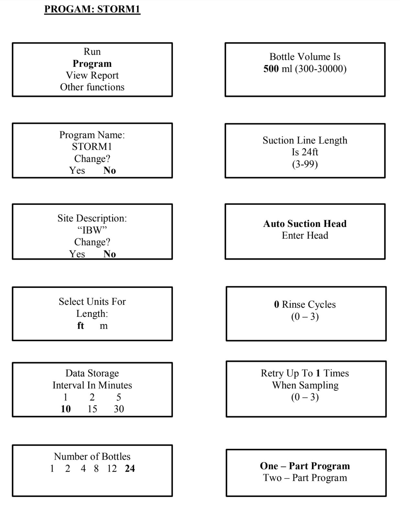
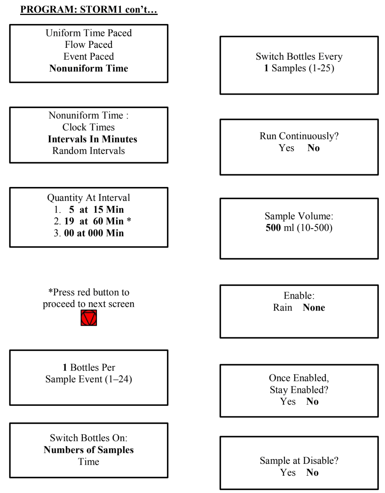
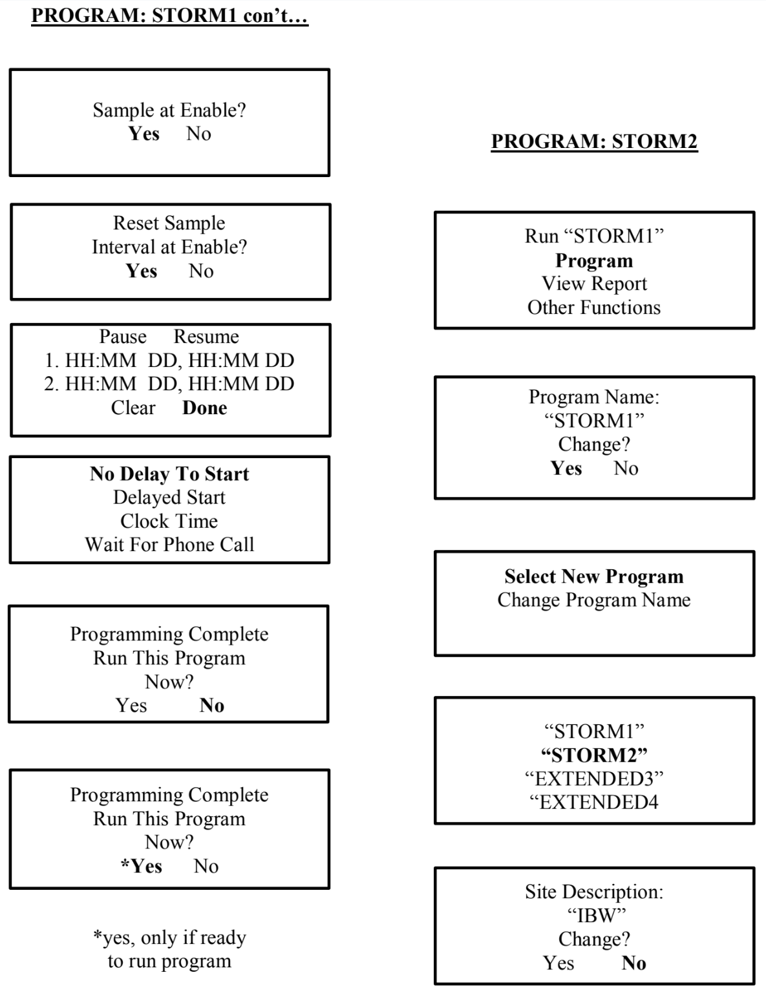
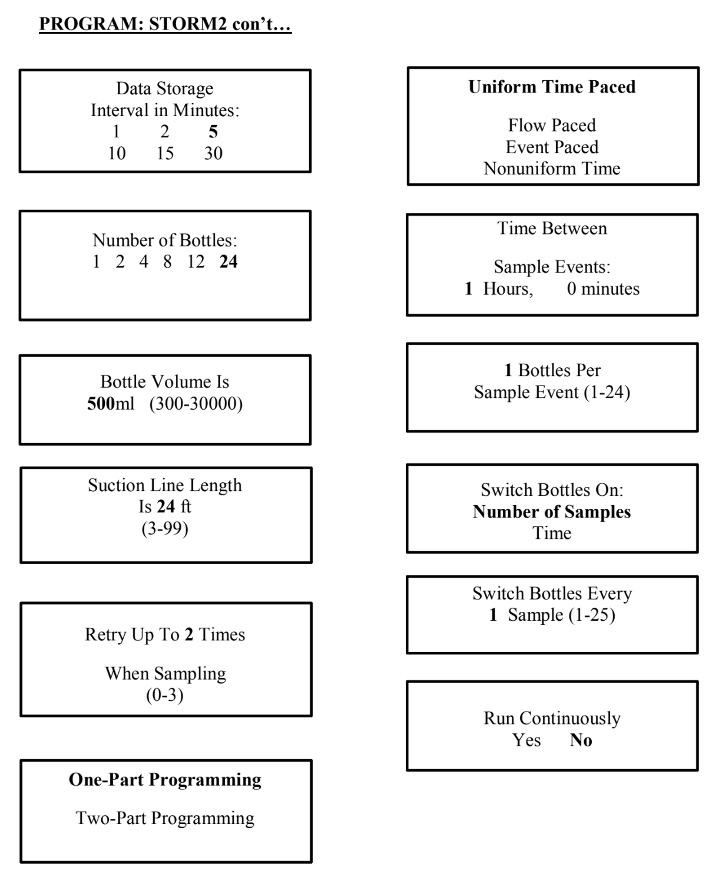
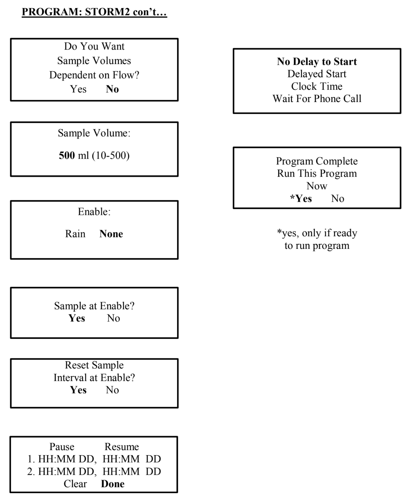
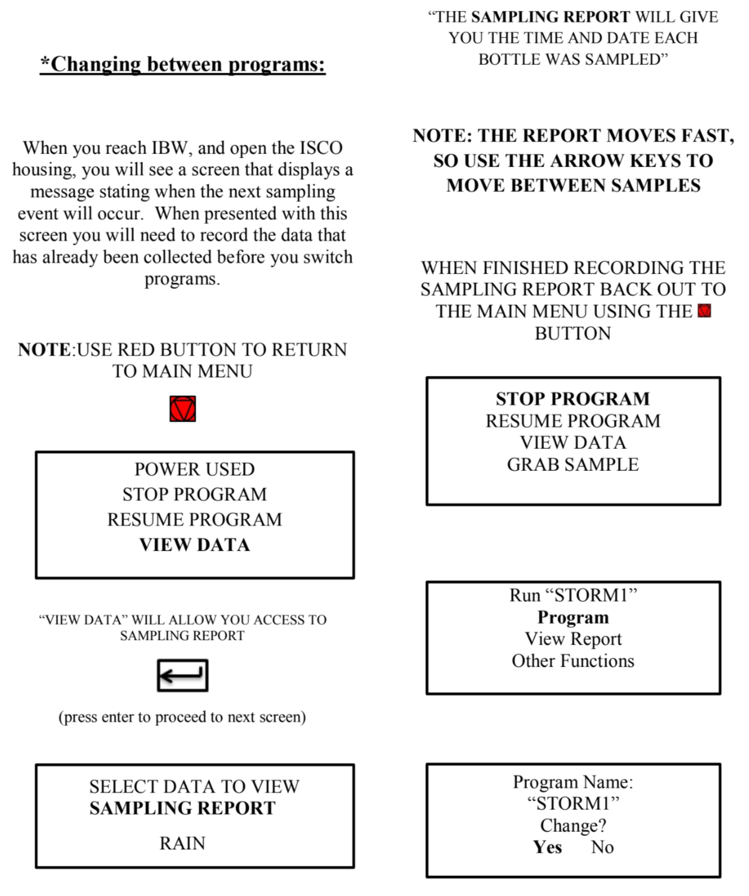
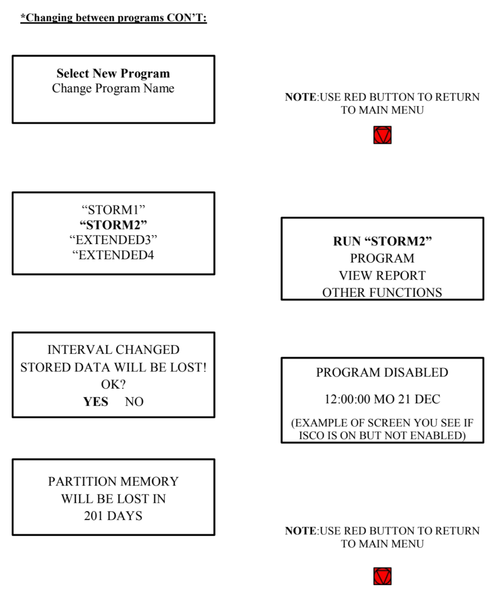

# **Stormwater ISCO IBW Programs 1 and 2**

Updated December 2015

This document gives detailed instructions for the Stormwater programs 1 and 2 of the ISCO located at Indian Bend Wash on Curry Road, Tempe AZ.

## **Equipment Location**

**Falcon tubes, doc vials, ammonium vials, and 125mL bottles:** GWC639 - CAP prep lab (lower middle cabinets on South side).  GWC639 is accessed through GWC677.

**Battery:** south side chemical fume hood GWC681

**ISCO tubes and cables:** GWC681 storage room

**Key ISCO Housing @ IBW:** GWC674 - CAP Tech office cork board, or in the Toyota Tacoma

**Conductivity Meter:** GWC681 storage room

## **Prior to leaving for the field, make sure you have these items:**

* fully charged battery

* field datasheets (located in ISCO housing)

* extra bottles (one full carousel is located in ISCO housing)

* pencil and sharpie (located in ISCO housing)

* ASU ID

* key for ISCO housing (located in Tacoma or tech office hanging from cork board)

* rain gear

* gloves

### **Check current conditions at IBW using this link:** <http://waterdata.usgs.gov/nwis/uv?site_no=09512162>

USGS 09512162

INDIAN BEND WASH

AT CURRY ROAD, TEMPE, AZ

**Figure 1.  Program: Storm1**

**Figure 2.  Program: Storm1 ctd.**

**Figure 3.  Program: Storm1 ctd. & Storm2**

**Figure 4.  Program: Storm2 ctd.**

**Figure 5.  Program: Storm2 ctd.**

**Figure 6.  Changing between programs.**

**Figure 7.  Changing between programs, ctd.**
