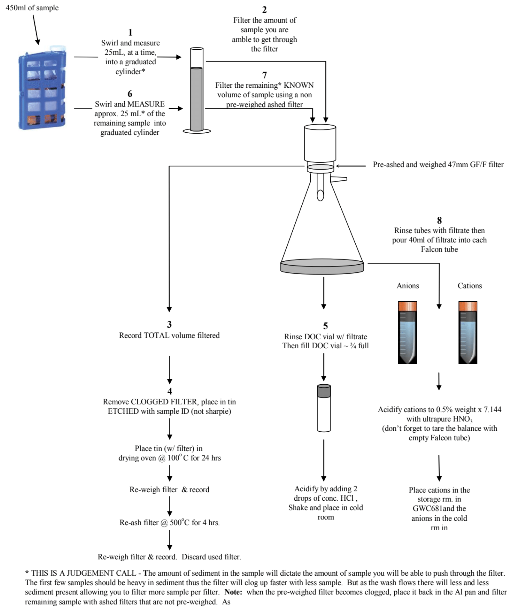

# **Stormwater ISCO Lab Protocol**

Updated August 2020

## **Sampling Equipment Location:**

* ISCO 6700 and 6712 - GWC 681
* 12 volt battery - GWC681 chemical hood - South hood
* Replacement 500mL bottles and carousels - GWC 681
* Spare tubing and parts for ISCO - GWC 681
* Protocol - GitHub
* Key for ISCO housing Indian Bend Wash site 11 located in Toyota Tacoma (#T0629)

## **Prior to sampling:**

* Ash 47mm GF/F filters in muffle oven at 500°C for four hours
* Use glass petri dish to house filters
* Let cool and place in drying oven at 60°C for 30 minutes
* After 30 minutes, place in desiccator until cool
* Scrub and rinse used bottles prior to placing bottles in acid (HCl) wash
* Acid (HCl) wash and rinse all ISCO bottles and caps using DI (deionized) water and place on drying cart
* Once dry cap bottles and place in carousel 
* Charge 12 volt battery and write charge date on battery using tape and sharpie
* Check ISCO for any signs of damage or dirt
* Wipe dust and dirt off of ISCO using damp paper towel
* Print field-lab sheets 
* Location of Field-Lab sheets Dropbox (ASU)\research\Stormwater\field-lab-sheets\blank_field-lab_sheets 
* Charge laptop before leaving for the field
* Make sure ISCO communication cable – RS232 is in laptop bag

## **Field Equipment Checklist:**

* Field data sheets
* Lock combination for ISCO housing - 4467
* Clean bottles for ISCO (24 sample bottles + 1 bottle placed in the middle of carousel for the blank)
* Put all caps inside a foil-lined plastic quart-sized Ziploc bag
* ASU ID
* Lab tape to label bottles
* Pencils and sharpie
* Fully charged 12 volt battery
* Laptop to ISCO communication cable - RS232
* Laptop with Flowlink software

## **ISCO sample retrieval and bottle replacement:**

* Upon arrival to site, note conditions of the wash (water level, flow…)
* If wash is still flowing, cap and label filled sample bottles
* Bottle label should include sample number and carousel number (11.1, 11.2, 11.3…)
* Replace filled bottles with clean unused bottles
* Note:  If wash stops flowing before program ends, unused bottles will need to be cleaned

## **Before leaving site, make sure that:**

* Data is downloaded from ISCO
* ISCO program (Storm1, Storm2, or Storm3) has been select and started
* ISCO housing is locked
* Data sheet is filled out as best as possible
* All samples bottles are labeled (using tape and sharpie) and tightly capped
* Check that unused bottles are uncapped
* Top (distributor arm) of ISCO body is seated on bottom (place where bottles are housed) body.  
* Return to lab, place in cold room if not able to process right away

## **Processing Pre-Filtered Samples in Laboratory:**

* Pre-filtered sampling takes place in GWC681
* Label tube and bottles using site id, carousel number, and bottle number
* Label using site color codes;
    * Site 9 LM (Lake Marguerite) – red
    * Site 10 SGC (Silverado Golf Course) – green  
    * Site 11(Indian Bend Wash at Curry road) – blue 
* 11.1.1 refers to IBW (Indian Bend Wash at Curry road) carousel 1, sample 1
* Agitate ISCO bottle, place conductivity probe in bottle, wait for meter to stabilize and record reading on field/lab data sheet
* Agitate ISCO bottle and pour into sample three(3) tubes; 
    * 15ml tube NH4 (ammonium)
    * 40 ml tube TN/TP (Total Nitrogen and Total Phosphorous)
    * 125ml Nalgene bottle AFDM (Acid Free Dry Mass) 
* Centrifuge 15ml tube (Ammonium) @ 8000rpm for 10 minutes
* When finished place in freezer and notify Yi as to sample location

## **TDS/TSS/TVS and DOC Combined Sample Processing Protocol**

**Figure 1.  Sample Processing: Do the first 8 steps in exact order, the remaining steps are up to the individual processing the samples.**

