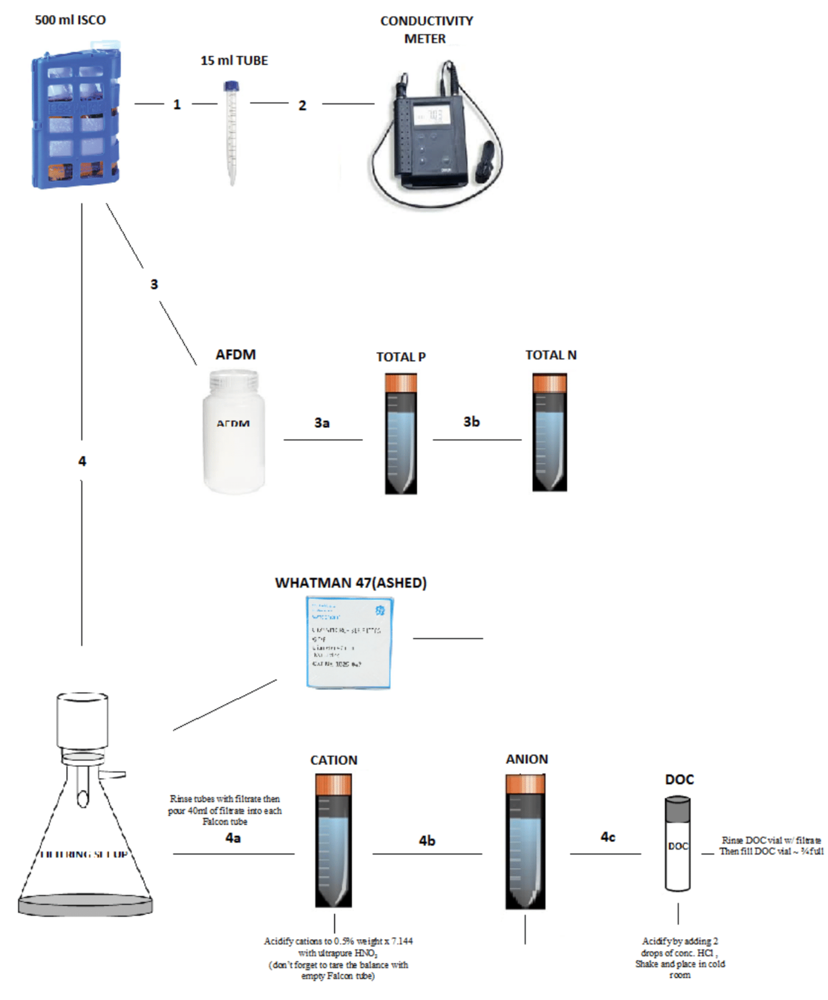

# **Stormwater Sampling and Filtering Protocol**

Updated August 2019

**Figure 1.  Protocol.**

1. Agitate 500mL ISCO bottle and rinse 15mL tube with sample. Discard rinse and fill tube 3/4 full.  

* filled 15mL tubes are placed in the freeze in GWC639.

* contact Marisa Masles to inform her about these stormwater samples: [Marisa.Masles@asu.edu](mailto:Marisa.Masles@asu.edu).

2. Agitate and place conductivity probe in 500mL ISCO bottle, record conductivity and temperature measurements.

* conductivity meter may need to be calibrated using the protocol located in conductivity box

* conductivity meter is located in GWC681 storage room

3. Agitate 500mL ISCO bottle and rinse 125mL AFDM bottle, and both Falcom tubes for Total P and Total N. Discard rinse and fill tubes. Fill the Falcon tubes to 40mL and fill the 125mL AFDM bottle.

* place Total P, Total N and AFDM samples in the freezer to freeze in GWC639

* place AFDM samples in labeled gallon Ziploc and try place them in freezer so they are standing up

## **Filtering:**

4. Place a pre-ashed Whatman 47mm GF/F filter in the filtering apparatus and rinse filter with a small amount of sample. Swirl filtrate around the Eralmire flask and discard. Filter remaining sample (using a small amount to rinse Falcon tubes and DOC vials). Use remaining filtrate to fill Falcon tubes for Cation and Anions and the DOC vial.

* fill Falcon tubes to 40mL

* acidity cations to 0.5% weight x 7.144 with ultrapure HNO3 (remember to tare the balance with empty Falcon tube)

   * HNO3 is kept under the North side fume hood in GWC681.

* store Cations in the GWC681 storage room and the Anions in the cold room in GWC675

* fill the DOC vial ~3/4 full

* acidify DOC samples by adding 2 drops of conc. HCl, shake and place in cold room in GWC675

Note: When filtering the sample the amount of sediment in the sample will dictate the amount of sample you will be able to push through the filter. If samples look heavy with sediment, pour small amount of sample through the filter and change filter when it becomes clogged. Replace with unused pre-ashed Whatman 47mm.