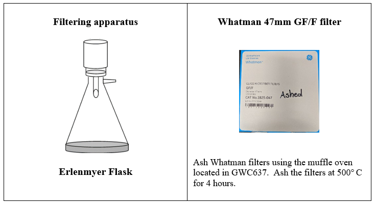

# **CAP - LTER Storm Water Sampling**

Updated August 2020

**Pre-filter sample Process**
* Agitate 500ml ISCO bottle and rinse 15ml tube for NH4 with sample.  Discard rinse and fill tube 15ml tube  ¾ full.
* Agitate and place conductivity probe in 500ml ISCO bottle, record conductivity and temperature measurements on lab data sheet.

* Agitate the 500ml ISCO bottle and rinse the 125ml AFDM bottle and the 50ml tube for Total P and Total N.  Discard rinse and fill tube.  Fill the Falcon tube to 40ml and fill the 125ml AFDM bottle.

**Filtering Sample Process**
* Place a pre-ashed Whatman 47mm GF/F filter in the filtering apparatus and rinse filter with a small amount of sample.   Rinse the Elmire flask by Swirling the filtrate around the Elmire flask and discarding the filtrate into the storm-water waste container.  

* Filter remaining sample (using a small amount to rinse Falcon tubes and DOC vials).   Use remaining filtrate to fill Falcon tubes for the Cation and Anions and the DOC vial.  

Note:  During heavy storms, filters will mostly likely become clogged at a faster rate.    When filtering samples. The amount of suspended sediment in the sample is a good indicator for the amount of sample, you will be able to push through the filter.  If this is the case pour less sample into the filtering appuratus and change the filter when it becomes clogged and replace with unused pre-ashed Whatman 47mm.