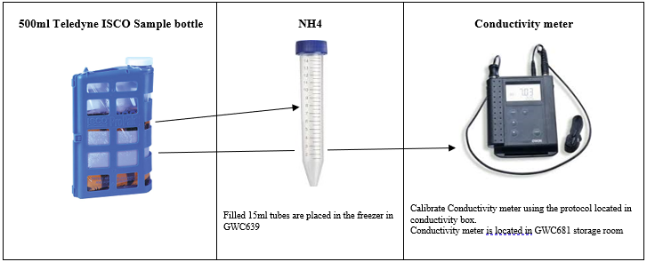

# **CAP - LTER Storm Water Sampling**

Updated August 2021

**Pre-filter sample Process**
* Fill a 15mL centrifuge tube for NH4 with ~12mls of sample from the 500mL ISCO bottle.
* Agitate and place conductivity probe in 500ml ISCO bottle, record conductivity and temperature measurements on lab data sheet.

* Agitate the 500ml ISCO bottle and rinse the 125ml AFDM bottle.  Discard rinse and fill bottle.  Fill the Total Nitrogen/Total Phosphorus centrifuge tube to ~40ml.

**Filtering Sample Process**
* Place a pre-ashed Whatman 47mm GF/F filter in the filtering apparatus and rinse filter with a small amount of sample.   Rinse the Erlenmyer flask by swirling the filtrate around and discarding the filtrate into the storm-water waste container.  

* Filter remaining sample (using a small amount to rinse DOC vials).   Use remaining filtrate to fill 50mL centrifuge tubes for the Cations, Anions and DOC vial.  

Note:  During heavy storms, filters will mostly likely become clogged at a faster rate.    When filtering samples. The amount of suspended sediment in the sample is a good indicator for the amount of sample, you will be able to push through the filter.  If this is the case pour less sample into the filtering appuratus and change the filter when it becomes clogged and replace with unused pre-ashed Whatman 47mm.
