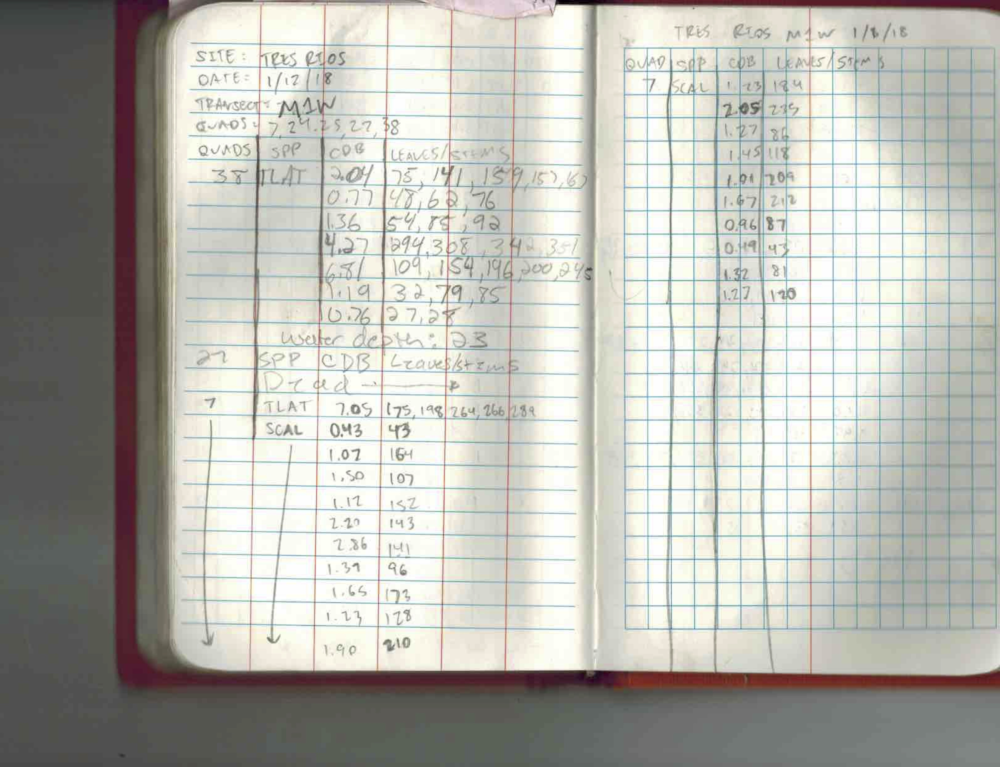
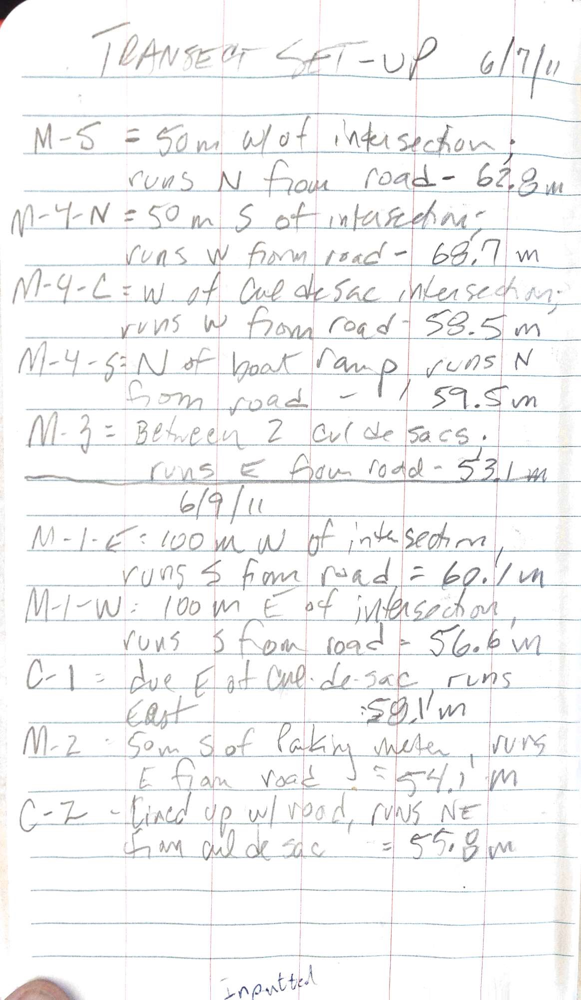
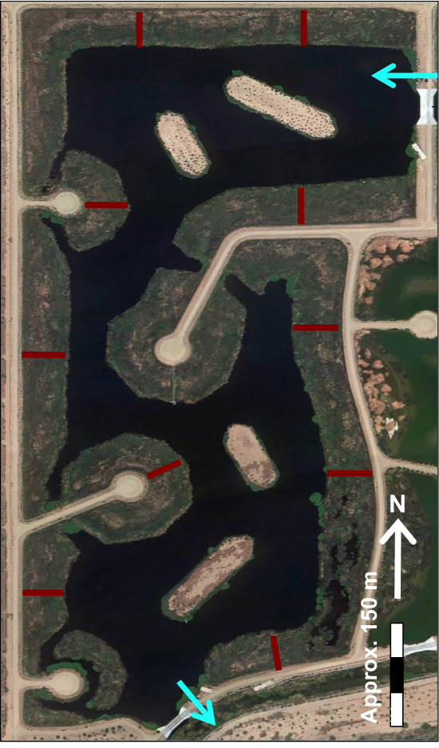

**Wetlands Ecosystem Ecology Lab (WEEL)**

**Standard Operating Procedure**

**Project:** Tres Rios Wetlands

**Procedure:** Aboveground Primary Productivity

**Purpose**

This SOP covers the field procedures for taking field measurements of
aboveground primary productivity at the Tres Rios wetlands.

**Potential Hazards**

Loose or muddy soils, insect bites or stings, uneven terrain, and
extreme summer temperatures, water.

**Materials**

- 0.25 m2 PVC quadrat

- Meter sticks

- Analog calipers (in metric)

- Keson tape measure (at least 50m long)

- Field data book(s)

- Marking flags

- Garmin GPS unit (optional – for finding transects)

- Waders

**Procedures**

1.  Before heading to the field, use a random number generator to
    generate and print 10 sets of 5 random numbers between values 1 and
    50.

    1.  These represent the distances (m) at which you will stop and
        place sampling quadrats on each of the 10 transects.

2.  Locate and park in front of the transect you will be sampling.

    1.  White PVC pole (~2m tall) will mark transect entrance, along
        with orange marking flags on either side of the road.

    2.  Sometime transect entrances can become overgrown, or City of
        Phoenix operations may disturb marking flags or PVC. In this
        case, use Garmin GPS to verify transect location. See Appendix B
        for transect location descriptions.

    3.  Replace any missing or damaged marking flags or PVC.

3.  Copy down quadrat sampling locations from random number printout
    into field data book.

    1.  See Appendix A for example of how to set-up a page in the field
        data book.

4.  Put on waders and distribute equipment to team members.

5.  Tie off Keson tape measure to PVC marking pole at the entrance of
    the transect.

    1.  Try to tie off using as little of the tape as possible.

6.  Walk transect to first sampling location, starting at the furthest
    quadrat and working your way back towards the shoreline (i.e.,
    ascending to descending numbers).

    1.  Transect path should be fairly obvious, but use Garmin GPS if
        path is thatched or unclear.

7.  Upon arriving at the sampling location, assess the sampling location
    to determine if there is any standing live biomass to measure.

    1.  If standing live biomass exists, continue with steps 8-12.

    2.  If no biomass is present, notate “EMPTY” or “OPEN WATER” in data
        book in data book next to corresponding quadrat and move on to
        next sampling location.

    3.  If biomass is present but mostly dead, notate “DEAD” in data
        book next to corresponding quadrat and move on to next sampling
        location.

    4.  If biomass is present but thatched (dead or alive), notate
        “THATCHED” in data book next to corresponding quadrat and move
        on to next sampling location.

8.  Assess placement location for quadrat

    1.  Sampling can be done on either side of the transect but be sure
        to keep it consistent once you start a transect.

    2.  Area to be sampled must meet two criteria: 1) sample within 1-2m
        away from transect path and 2) select a sample that is fairly
        representative of the general patch dynamics near location.

9.  Detach removable quadrat side (zip-tie will indicate removable side)
    and set the quadrat at the meter-mark of interest. Place quadrat
    right above the water level. Reattach removable side.

    1.  Do not intentionally include or exclude plants from the quadrat
        perimeter.

    2.  Plants to be measured are all those where entire plant
        (including roots) falls within the vertical profile of the
        quadrat

10. “Clean” up sampling location as necessary to ensure easy measuring –
    remove dead plants, relocate thatched plants, etc.

11. Use a meter stick to take a 3-point average of water depth (from
    soil surface). Record in the field book.

12. Distribute measurement tools to appropriate team members.

    1.  Data scribe – field data book

    2.  Measurers – one pair of calipers and one meter stick per person

13. Sample all plants within the quadrat:

    1.  Data scribe – write down all measurements as provided by team
        members.

        1.  See Appendix A for example of how to structure data entry.

    2.  Measurers – start with culm diameter at base (CDB), and then
        move on to measure plant leaves/stems/seeds

        1.  For CDB, take measurement on widest part of the plant at
            water level.

            1.  Measurements read as “X.YZ” – where X = cm on sliding
                bar, Y = large number on dial, and Z = smaller tick
                marks on dial.

        2.  For leaves (*Typha spp.*), bunch all leaves together and
            progressively measure from shortest to longest leaf. When
            you read the “end” of the meter stick, mark your place with
            thumb and fingers and move the meter stick up.

            1.  Be sure to keep track of how many times you have moved
                your meter stick (0-100cm, 100-200cm, etc.).

            2.  Round all measurements to the nearest cm.

        3.  For *Schoenoplectus spp.* Seeds, measure number of green
            seed stems.

        4.  For *Typha spp.* pistillates, measure length using meter
            stick (nearest cm) and width using calipers.

        5.  See Appendix C for table on species and corresponding
            metrics of interest.

14. Repeat steps 7-13 for 4 remaining sampling locations for the current
    transect (total n = 5).

15. Repeat steps 5-13 until all transects have been sampled.

**References:**

N/A

**APPENDIX**

**A. Sample field data book scan**

**B. Transect locations**

<figure>
    <figcaption><strong>Figure B1.</strong> Left: field setup at transect entrance. Right: schematic layout of transects.</figcaption>
    

        

            
        

        

            
        

    

</figure>

**C. Metrics of interest**

| **Genus**             | **Species**                                      | **Flowering/seeds?** | **Metrics**                                         | **Notes**                                                  |
|-----------------------|--------------------------------------------------|----------------------|-----------------------------------------------------|------------------------------------------------------------|
| *Typha spp.*          | *T. latifolia, T. domingensis*                   | No                   | CDB, length lengths                                 |                                                            |
| *Typha spp.*          | *T. latifolia, T. domingensis*                   | Yes                  | CDB, total stem height, pistillate length and width | total stem height = length to brown tip of pistillate stem |
| *Schoenoplectus spp.* | *S. acutus, S. californicus, S. tabernaemontani* | No                   | CDB, total stem height                              |                                                            |
| *Schoenoplectus spp.* | *S. acutus, S. californicus, S. tabernaemontani* | Yes                  | CDB, total stem height, number of seed stems        | 1 seed stems = base-most bunching of green stems           |
